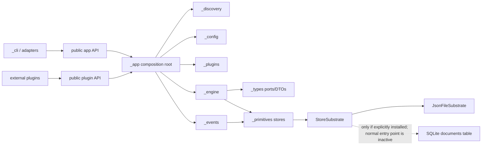
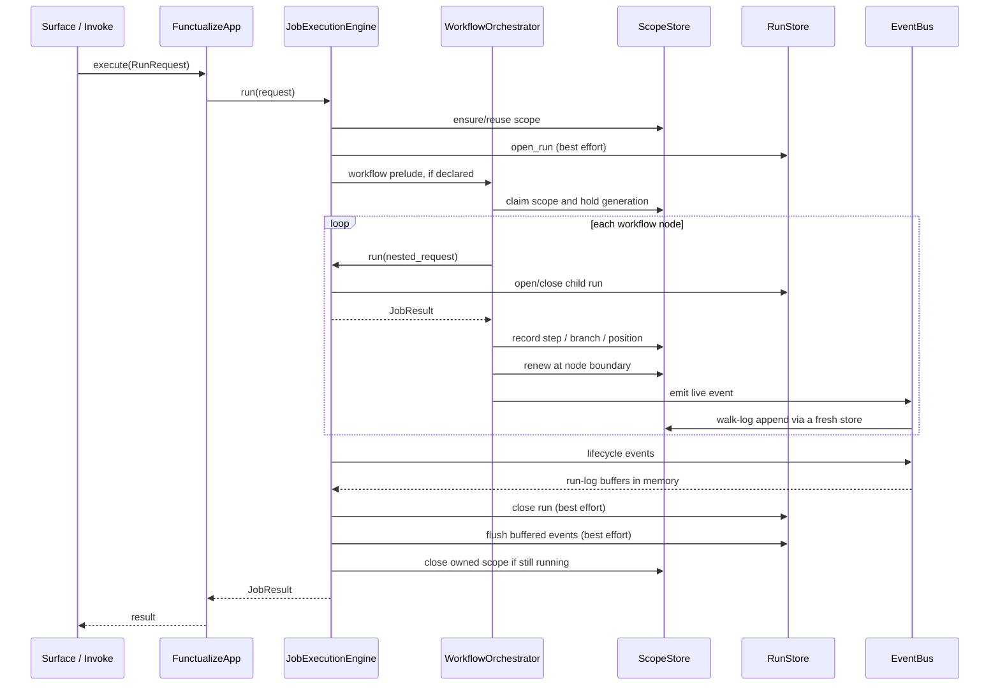
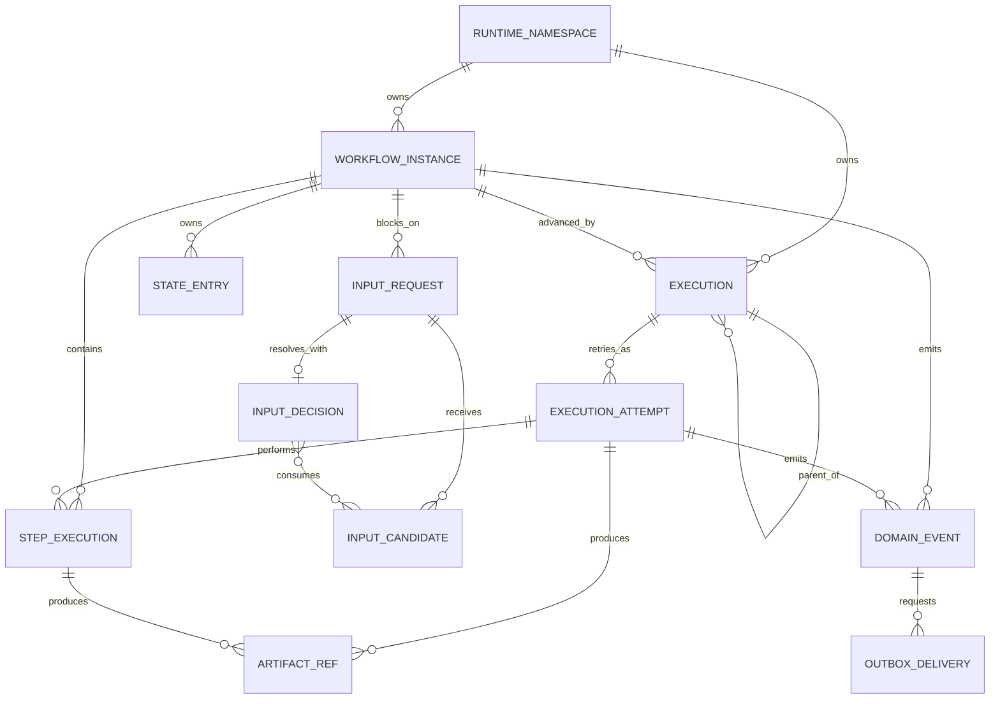
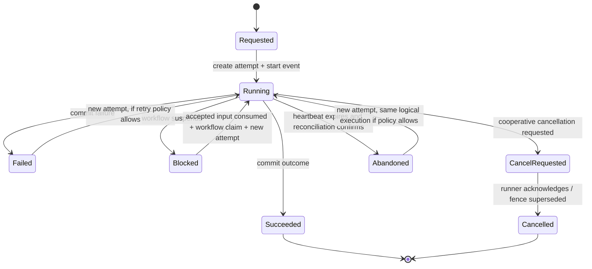
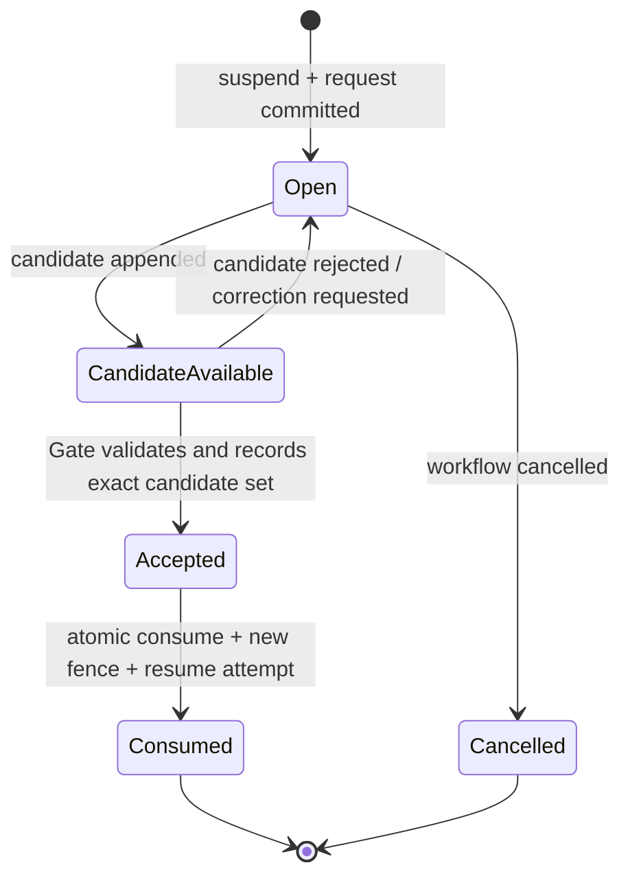
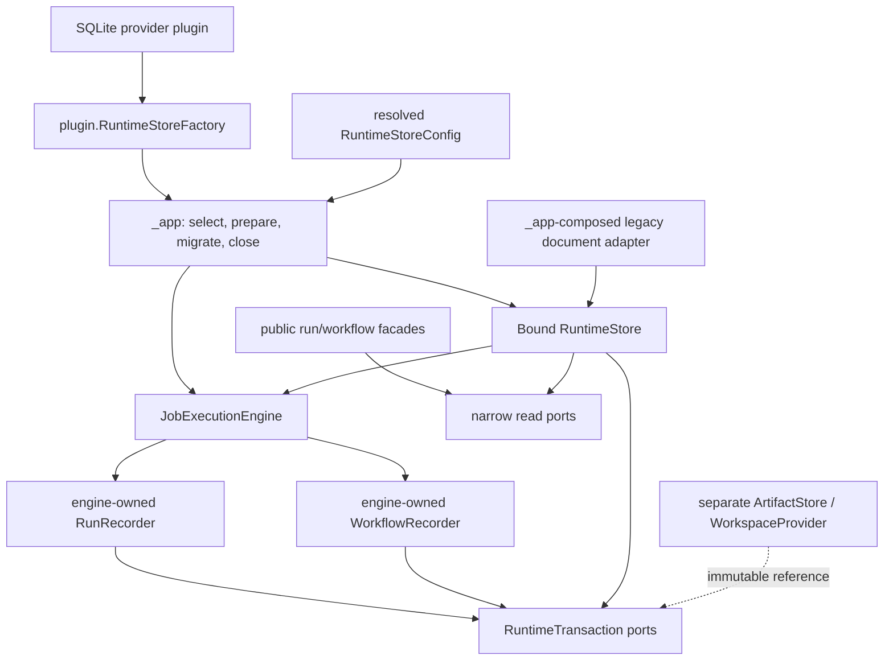

# Independent Architecture Review: Runtime Persistence and Relational Storage

**Review date:** 2026-09-21
**Reviewer stance:** independent, adversarial, read-only
**Repository:** `functualize`
**Current branch:** `feat/substrate-sqlite`
**HEAD:** `b0148f850245541223021991ed22138e72c9f246` (`v0.3.0`)
**Default branch:** `master`
**Recommendation:** **redesign before implementation**

This review does not use C4 as its governing decomposition. Existing pages with
“C4” in their title are treated as proposal evidence only. Package ownership,
runtime call paths, aggregate boundaries, state transitions, transaction
boundaries, and failure semantics are the governing views here.

## 1. Executive verdict

### Overall assessment

The proposal identifies the right failure class but has not yet defined a safe
implementation architecture. Its strongest decisions are:

- one explicit runtime-store choice per application;
- relational columns for operational facts and JSON only for opaque payloads;
- short transactions around domain transitions, never around job code;
- durable event/effect intent committed with the transition;
- live `EventBus` notification only after commit;
- SQLite limited to local/single-host deployment;
- workspace/blob ownership separated from runtime records;
- no indefinite dual write during migration.

Those decisions are supported by the live code and should be retained. The
single-file payload is not the root problem. It is one symptom of four deeper
problems: runtime meanings are bundled in `ScopeStore`; current correctness
depends on object-local and timing-sensitive wiring; the lifecycle has no atomic
transition boundary; and records do not cleanly distinguish logical execution,
attempt, workflow instance, step execution, input request, event, and external
effect.

Implementation should not proceed from the current package and ticket order.
The proposal presently:

1. puts backend-neutral transition ownership in a new `_persistence` peer,
   creating a second authority beside `JobExecutionEngine` and its workflow
   collaborators;
2. specifies a provider/UoW family before specifying legal domain transitions
   and aggregate ownership;
3. promises one semantic contract across a document adapter and transactional
   SQL although the document layout cannot provide the proposed cross-document
   atomicity;
4. lacks explicit execution attempts, dispatch idempotency, cancellation
   states, payload versions, and a durable heartbeat policy;
5. describes a non-deduplicating outbox provider as “at-most-once,” which is not
   achievable without choosing possible loss over retry;
6. proposes a mutable bind-once handle although the repository already states
   that the engine is complete at construction.

### Conditions that must be resolved first

Before implementation, approve ADRs that settle:

- the logical aggregates and state machines, including whether a run is a
  logical execution or one attempt;
- the exact guarantees for job execution, workflow continuation, input
  consumption, and external effects;
- which layer owns transition orchestration;
- provider construction, resource lifetime, disposal, and per-application
  isolation;
- the compatibility adapter's deliberately weaker semantics;
- schema/serialization versioning, retention, and migration authority;
- the first network database and whether it is actually required for 1.0.

Then reorder the work so state machines and invariants precede physical schema
and public provider APIs.

### Confidence

**High (0.90)** for the current runtime reconstruction and the principal
architectural objections. The relevant production paths were verified in live
files with ripgrep, Serena, zvec-grep, and Graphify; indexed results were checked
against the checkout. Graphify was generated from an older branch and was used
only as navigation/coupling evidence. zvec coverage was incomplete and likewise
was not treated as authoritative.

**Medium-high (0.80)** for Confluence/Jira traceability. Both systems were
accessible read-only. The Confluence connector reported lossy Markdown
conversion for some macro-bearing pages, but the substantive page bodies,
titles, versions, statuses, and links were readable.

### Git and evidence baseline

| Fact | Result |
|---|---|
| Current branch | `feat/substrate-sqlite` |
| HEAD | `b0148f850245541223021991ed22138e72c9f246` |
| Merge base with `master` | HEAD itself |
| Commits unique to branch | none |
| Committed files changed from `master` | none |
| Local/`origin/master` tracking comparison | checkout `b0148f8`; fetched `origin/master` `8c06198`; `origin/master...HEAD` reported `3 0` (remote three ahead, branch zero unique commits) |
| Fetch status | the first fetch failed because `/etc/ssh/ssh_config.d/20-systemd-ssh-proxy.conf` had unsafe ownership/permissions; a later fetch succeeded with an isolated SSH configuration (`ssh -F /dev/null`), without changing the host file |
| Worktree state before report | modified `.serena/project.yml`, `.spec/ARCHITECTURE.md`, architecture overview/codemaps; untracked runtime-persistence research package and codemap |

The branch therefore introduces no implementation. The reviewed proposal is an
uncommitted documentation change over behavior merged to `master` in PR #39
(`d850dfb`, with substrate commits including `ab88dd9`, `3490641`, `16aad18`,
and `7ecdfc8`) and released at `b0148f8`.

After the main review was completed, remote master was fetched at `8c06198`
(PR #45). That change adds a public typed `PluginHost`, moves the SQLite package
to `plugins/substrates/functualize-substrate-sqlite`, registers it under the
normal `functualize.plugins` entry-point group, and adds a real-app activation
test. Those changes materially address the plugin-activation/private-host/name
findings recorded against `b0148f8`; they do not by themselves resolve the
transition-ownership, logical-model, compatibility-guarantee, or external-
effect blockers. Findings below retain the checkout baseline and should be
read with this delta qualification.

| Status class | What belongs there |
|---|---|
| Current implemented behavior | v0.3.0 whole-document `StoreSubstrate`, JSON default, best-effort run/events, workflow leases/fencing, one engine path |
| Introduced on current branch | No committed behavior; only uncommitted architecture/research and codemap edits |
| Recently merged on `master` | PR #39's substrate/run model and preceding durable workflow/resume work; PR #45's typed plugin host and corrected SQLite plugin activation/package taxonomy |
| Proposed future behavior | provider factory, domain ports/UoW, relational SQLite, atomic resume, durable events/outbox |
| Aspirational roadmap | generalized evidence/evaluation, AgentFS-backed workspace, unspecified network SQL and wider 2.0 trust/replay goals |
| Transitional architecture | document adapter behind new ports, direct-store facade migration, offline legacy import/cutover |

## 2. Independent current-state architecture

### Current behavior

Boot constructs the execution engine in `_app`, loads standard plugins from the
`functualize.plugins` group, resolves configuration, registers jobs, fires
`APP_READY`, validates DI, and freezes the registry. Both static and standard
boot call the same `build_engine` construction site
(`src/functualize/_app/boot.py:214-263`). Standard plugin loading occurs before
config resolution (`boot.py:718-798`); `APP_READY` occurs after job registration
and plugin validation and before DI freeze (`boot.py:841-873`). Static boot has
the same material ordering (`boot.py:396-474`).

All job surfaces converge on `JobExecutionEngine.run(RunRequest)`
(`src/functualize/_engine/executor.py:741-854`). A run is given a scope, its run
record is opened best-effort, the single lifecycle executes, and run/scope
records are closed in `finally`. Contrary to the stale method prose saying only
top-level runs are recorded (`executor.py:768-781`), `_open_run_record` records
every run, including nested and parallel runs (`executor.py:916-984`).

The engine resolves one `StoreSubstrate` lazily and caches it. The host may
provide one; otherwise `substrate_for_project` always constructs a filesystem
implementation (`src/functualize/_primitives/substrate.py:253-273`). Five
document-oriented stores use that substrate: freshness, scopes, per-scope state,
runs, and shell history. `StoreSubstrate` is six physical operations over whole
mapping documents, not a domain persistence contract
(`src/functualize/_types/protocols.py:736-895`).

That one-choice invariant is only true inside paths that resolve through the
app/engine. Several pre-boot builtins construct filesystem stores directly:
`data show`, `data clear`, `run`, and `history` call `RunStore.for_project` or
`FreshStore.for_project` (`src/functualize/_cli/builtins.py:854-916,950-1000,
1786-1796,1996-2006`). Workflow flags and MCP correctly use
`app.execution_engine.substrate` (`app/adapters/workflow_flags.py:227-238` and
`plugins/functualize-mcp/_history_tools.py:43-55`). Thus a manually installed
SQLite substrate can write run history that `func builtin run/history/data`
does not read. “One backend” is an intended engine invariant, not a currently
universal surface invariant.

`ScopeStore` is the effective workflow aggregate. It owns scope status, graph
identity, steps, branches, gates, position, epilogue, state delegation, events,
tool calls, lease data, and retention. Its `_mutate` path does locked
read-modify-write and only fences writes when that particular Python store
instance has an object-local held generation
(`src/functualize/_primitives/scope_store.py:235-280`). `RunStore` separately
owns run trees and run events. No transaction spans these documents.

The installed SQLite plugin is not a relational runtime store. It maps each
logical document to `documents(key, payload, revision)`
(`plugins/functualize-state-sqlite/src/functualize_state_sqlite/substrate.py:54-60`).
It uses one thread-local connection, WAL, a 10-second busy timeout, and
`BEGIN IMMEDIATE` for all writes (`substrate.py:68-90,141-170`). It has no
foreign-key enablement, schema version/migration owner, or close/disposal path.

The plugin is also not reached by normal plugin discovery. It registers under
`functualize.state_providers`
(`plugins/functualize-state-sqlite/pyproject.toml:23-24`), while the loader uses
`functualize.plugins`; the domain registry is explicitly reporting-only and does
not activate providers (`src/functualize/_plugins/domain_registry.py:1-17`). A
live probe found the SQLite entry point installed but a normal
`FunctualizeApp` loaded the standard plugins and resolved `JsonFileSubstrate`.
The current SQLite tests construct or inject the substrate directly, so they do
not prove production activation.

### Package/dependency diagram



This matches the enforced rule that peer layers do not import each other and
`_app` performs cross-layer wiring
(`contributor/reference/layer-rules.md:19-27,38-42` and
`contributor/architecture/dependency-graph.md:47-59,80-104`). The current
SQLite plugin violates the public-plugin rule by importing private
`functualize._events.hooks` in its registration method
(`plugins/functualize-state-sqlite/src/functualize_state_sqlite/_plugin.py:55-58`;
the rule is `contributor/guides/plugin-development.md:242-249`).

### Execution sequence



The authoritative job lifecycle remains the documented twenty-step
`_execute_lifecycle` sequence (`contributor/reference/execution-lifecycle.md:1-41`).
The workflow prelude runs before DI and hooks. Nested workflow steps call the
same engine path (`src/functualize/_engine/workflow_orchestrator.py:92-152`).
Nested workflow record IDs are derived separately while the Python scope object
is shared for `State`, a distinction the proposal must preserve
(`workflow_orchestrator.py:109-150`).

### Current failure, cancellation, and resume paths

- **Success/failure:** `_close_run_record` or `_close_run_record_failed` is called,
  but opening and closing records swallow persistence errors
  (`executor.py:916-984,986-1033`). Durable history is therefore observational,
  not authoritative.
- **Crash:** run events buffered by `RunLogSubscriber` are lost before
  `close_run`; the subscriber explicitly writes only at run end
  (`src/functualize/_events/run_log.py:121-195`).
- **Live events:** `EventBus` dispatches synchronously and swallows subscriber
  failures (`src/functualize/_events/bus.py:343-410`). The walk-log subscriber
  creates a store and appends after emission (`_events/walk_log.py:81-109`).
- **Resume:** `resume_scope` persists an answer first, then separately starts a
  new engine run (`src/functualize/app/_workflow_control.py:279-386`). Input
  consumption and winning the claim are not atomic.
- **Cancellation:** `cancel_scope` force-claims, then writes status, but catches
  all claim errors and proceeds (`_workflow_control.py:400-453`). Claim and
  cancellation are not one atomic semantic operation.
- **Lease/heartbeat:** a walk claims at start and renews only after a node
  returns (`src/functualize/_engine/frontier.py:260-286` and
  `workflow_walker.py:511-518`). A step longer than 300 seconds has no mid-step
  heartbeat despite comments claiming renewal makes the lease measure silence.
- **Current fencing defect:** `claim_scope` writes without `expect`, and
  `_mutate` ignores the return value (`scope_store.py:235-266,715-751`). With a
  no-op lock, two concurrent claimants can both read generation N and both return
  N+1. A review probe forced that interleaving and returned
  `[('a', 2), ('b', 2)]`. The existing “without locking” tests make sequential,
  not concurrent, claims (`tests/primitives/test_lease_fencing.py:224-253`); the
  concurrent test uses the real lock
  (`tests/workflow/test_cancel_wins_the_race.py:132-161`). The shipped claim that
  fencing is lock-independent is contradicted.

## 3. Claim verification matrix

| ID | Architectural claim | Claim source | Code/document evidence | Verdict | Severity | Recommended action |
|---|---|---|---|---|---|---|
| C-01 | Every execution surface converges on one engine path. | ADR-020; repository architecture | `executor.py:741-854`; workflow children use `engine.run` at `workflow_orchestrator.py:92-152`. | Verified | — | Preserve `RunRequest -> JobExecutionEngine.run`; do not add a persistence execution path. |
| C-02 | One substrate choice currently moves all framework documents and readers together. | ADR-022; `.spec/ARCHITECTURE.md` | Engine-created stores share `EngineHost.substrate` (`_types/protocols.py:447-466`), but pre-boot `data`, `run`, and `history` builtins use `RunStore/FreshStore.for_project` (`_cli/builtins.py:854-916,1786-1796,1996-2006`). | Partially verified | high | Preserve one runtime choice, narrow it to authoritative runtime records, and route every reader/admin surface through the app facade. |
| C-03 | Installing the SQLite package activates SQLite persistence. | SQLite README/plugin commentary; entry-point catalog | Entry point is `functualize.state_providers` (`pyproject.toml:23-24`), while the normal loader scans `functualize.plugins`; live probe resolved `JsonFileSubstrate`. | Contradicted | high | Add a production entry-point test before treating SQLite data as a migration source. |
| C-04 | Current run history/evidence is durable authority. | Some run-model prose and UI behavior | `_open_run_record` and scope close swallow errors (`executor.py:916-984,986-1033`); run events are memory-buffered until close (`run_log.py:121-195`). | Contradicted | high | Label current records best-effort; target authority must fail/route explicitly on persistence failure. |
| C-05 | Current fencing remains correct without locking. | `lease.py:31-41`; ScopeStore comments | Concurrent no-lock review probe produced two winners at the same generation; tests only serialize the no-lock claims. | Contradicted | blocker | Add atomic CAS claim now or stop documenting current resume as lock-independent. Make this a characterization gate for FUN-16. |
| C-06 | Current walk-log writes are fenced. | `_events/walk_log.py:89-92` | The subscriber resolves a fresh `ScopeStore`; `_mutate` fences only generations held in that instance (`scope_store.py:250-257`). | Contradicted | high | Durable event writes must be part of the owning transition and carry an explicit generation. |
| P-01 | The canonical package is target architecture, not implemented behavior. | [Canonical package](https://raicing-ai.atlassian.net/wiki/spaces/FUN/pages/5308716/Runtime+Persistence+Architecture+Canonical+Design+Package) | Page status says “Target architecture; not yet implemented”; Git shows no branch commits and only uncommitted docs. | Future design, accurately labeled | — | Retain the status boundary on every mirror. |
| P-02 | `_app` remains the sole composition root. | Target architecture lines 5-7; FUN-17 | Proposal says so; repository rules require it (`layer-rules.md:21-27`). | Future design, accurately labeled | — | Keep registry selection/construction in `_app`. |
| P-03 | A matched provider/UoW prevents split runtime repositories. | Target architecture lines 13-16,40-70; FUN-17 | Structurally plausible, but provider exposes lifecycle, queries, admin, migration, UoW, and close; aggregate boundaries are unsettled. | Partially verified | high | Define state transitions first; split factory/setup, bound store, read ports, and admin concerns. |
| P-04 | `_persistence` can be an independent peer that owns transition services. | Target architecture lines 123-149 | Repository says execution lifecycle authority is the engine (`execution-lifecycle.md:1-41`). A peer `transitions.py` importing `_events` creates a second lifecycle authority. | Contradicted | blocker | Keep transition orchestration in engine-owned collaborators; inject `_types` ports. Do not add `_persistence` absent a demonstrated responsibility unavailable to existing layers. |
| P-05 | The proposed schema is relational and queryable. | Data-model page lines 23-91; FUN-18 | Operational fields are normalized and indexed; JSON is bounded to payloads. | Future design, accurately labeled | — | Retain the normalization rule after logical-model corrections. |
| P-06 | SQLite is local/single-host, not multi-machine. | Decisions RP-6; FUN-19/FUN-22 | Correct for a local SQLite file. Current plugin source falsely says different machines can reach it (`substrate.py:20-22`). | Future design, accurately labeled | high | Correct current docs immediately; require a true network service for distributed proof. |
| P-07 | Suspend, accepted input, claim, and resume are atomic. | Data-model transaction catalog lines 93-104; FUN-20 | Proposed as one transition but request states/generations, legal transitions, and double-consume constraint are not defined. Current code is two operations. | Partially verified | blocker | Define request and workflow state machines plus one conditional consume-and-claim operation. |
| P-08 | A non-deduplicating outbox provider can declare at-most-once delivery. | Target architecture lines 181-184 | Crash after provider acceptance and before acknowledgement cannot distinguish delivered from not delivered. Retry duplicates; no retry can lose. | Contradicted | blocker | State “at-least-once with possible duplicates,” “at-most-once with possible loss,” or effective-once with receiver idempotency. |
| P-09 | The document adapter has fencing. | Target capability table lines 204-212 | Current no-lock claim can yield the same generation twice; cross-document atomicity is also unavailable. | Contradicted | blocker | Mark the adapter `legacy/local coordination only`; do not run transactional guarantees against it. |
| P-10 | Workspace persistence is a separate optional capability. | [Initiative](https://raicing-ai.atlassian.net/wiki/spaces/FUN/pages/4816898/Initiative+Runtime+Persistence+and+Relational+Substrate); FUN-23 | Clear logical separation; ambient filesystem remains default. | Future design, accurately labeled | — | Retain, but defer backend implementation from the 1.0 runtime critical path. |
| P-11 | Explicit provider selection occurs once and fails closed. | Target architecture lines 88-105; FUN-17 | Fits current one-choice invariant and fixes the plugin's catch-all fallback (`_plugin.py:60-82,97-113`). | Future design, accurately labeled | — | Build provider fully before engine construction; do not use a late-bound handle unless an ADR proves necessity. |
| P-12 | One semantic provider suite can cover document, SQLite, and network SQL. | Migration page lines 123-146 | Shared domain outcomes are useful, but atomicity, fencing, notifications, and migration semantics are not common to the document adapter. | Partially verified | high | Separate baseline semantic tests from capability-specific guarantee suites. |
| P-13 | The schema models attempts/retries. | FUN-18 requires “steps/attempts”; initiative relational direction | `workflow_steps` is unique on scope+step+iteration and `runs` has no attempt relation (`11-data-model...:34-52`). Exec retry loops inside one run (`exec_policy.py:108-130`). | Contradicted | high | Decide explicitly whether retries are evidence-bearing attempts and add attempt identity or declare them out of scope. |
| P-14 | 2.0 needs are only forward-compatibility constraints, not committed 1.0 scope. | [Northstar 2.0](https://raicing-ai.atlassian.net/wiki/spaces/FUN/pages/4849705/Functualize+2.0.0+North+Star+Trusted+Evaluable+Distillable+Agentic+Work); FUN-18 | Northstar 2.0 is “PROPOSED”; canonical package repeats that boundary. | Future design, accurately labeled | — | Keep stable IDs/versions, but defer generalized evidence/evaluation systems. |
| P-15 | Starting a run should atomically claim/ensure its workflow scope. | Target lines 151-163; data model lines 93-104 | Current plain jobs, resumed workflows, child jobs, and nested workflows have different scope ownership; every run gets a scope but not every run owns/claims it (`executor.py:783-914`). | Contradicted | blocker | Define separate start operations for plain execution, workflow continuation, and nested child execution. |

## 4. Architecture findings

### Blocker — Persistence is being made an execution-domain authority

**Evidence.** The proposal places `transitions.py` in a new `_persistence` peer
and routes `engine -> RuntimeTransitionService -> RuntimePersistenceHandle`
(`10-target-architecture.md:128-149`; codemap target at
`contributor/architecture/codemaps/runtime-persistence.md:59-87`). The repository
states that every job runs through `JobExecutionEngine._execute_lifecycle`
(`execution-lifecycle.md:1-14`) and peer layers communicate through `_types`
ports wired by `_app` (`dependency-graph.md:47-59,80-104`).

**Consequence.** A transition service that decides start, suspend, resume,
complete, cancel, and effect emission becomes a second execution kernel. It will
either envy `_engine` for lifecycle context or pull engine rules into a storage
package. Import legality would not make responsibility ownership correct.

**Smallest correction.** Keep domain transitions in engine-owned collaborators
(`RunRecorder`, `WorkflowRecorder`, or similarly narrow names) and inject
capability-specific `_types` ports. `_app` constructs the provider. Add no new
peer layer unless an ADR demonstrates a cohesive responsibility that is neither
execution semantics, composition, nor a concrete adapter.

### Blocker — The logical model is under-specified for the promised guarantees

**Evidence.** The schema lists rows and indexes but not legal transition tables
or invariants for run status, cancellation, input-request consumption, retry
attempts, step attempts, dispatch idempotency, or artifact staging
(`11-data-model-and-transactions.md:23-105`). FUN-18 explicitly requires
attempts and idempotency, but the schema has no execution/step attempt identity.

**Consequence.** DDL will freeze ambiguous semantics. Later fixes will require
schema changes precisely where migration stability is being advertised.

**Smallest correction.** Before ports or DDL, write state machines and an
operation catalog with preconditions, atomic writes, outcomes, and idempotency
keys. Decide whether `run` means logical execution or attempt. Persist code/
workflow revision identity without attempting to store executable definitions.

### Blocker — The compatibility contract promises what documents cannot provide

**Evidence.** Wave 2 requires a document adapter to pass the same contract where
capabilities permit and also requires rollback with no partial transition
(`12-migration-and-delivery.md:43-53`). Current scope, state, and run data live in
separate documents; `JsonFileSubstrate` has per-key file locks and explicitly
cannot implement one atomic multi-file replace
(`src/functualize/_primitives/substrate.py:230-250`). The target capability table
nevertheless says document fencing is supported
(`10-target-architecture.md:204-212`).

**Consequence.** Either the “semantic contract” collapses to the weakest backend,
or the adapter passes tests that never exercise the promised atomicity.

**Smallest correction.** Define a baseline behavior contract and separate
guarantee contracts. The document adapter is a temporary legacy store with
explicit local/best-effort semantics. Features requiring atomic resume, durable
outbox, or cross-record fencing refuse it during preflight.

### Blocker — External-effect guarantees are impossible as written

**Evidence.** The design says an outbox is at-least-once with receiver
idempotency, but a provider that cannot deduplicate declares at-most-once
(`10-target-architecture.md:181-184`). Wave 5 correctly identifies the crash
after provider acceptance (`12-migration-and-delivery.md:91-100`) but supplies no
way to observe whether acceptance occurred before process death.

**Consequence.** Operators may rely on a false no-duplicate guarantee. The
failure window is inherent, not an implementation detail.

**Smallest correction.** Expose delivery policy precisely:

- at-least-once, duplicates possible;
- at-most-once, loss possible (mark-before-send);
- effectively-once only with an idempotency key honored by the receiver or a
  transactional resource shared with it.

Never retry arbitrary external work inside a database transaction retry.

### Blocker — Start/run/scope ownership is conflated

**Evidence.** The proposed “start” transaction claims/ensures scope, inserts a
run, and appends events (`10-target-architecture.md:151-159`). Current behavior
distinguishes scope minters, named-scope resumes, child invocations, ordinary
steps, and nested workflows (`executor.py:783-914` and
`workflow_orchestrator.py:109-150`).

**Consequence.** A universal start operation can close or fence a parent's
scope, create unnecessary workflow rows for plain jobs, or claim a shared state
scope for a child that does not own workflow continuation.

**Smallest correction.** Define distinct operations: `start_execution`,
`start_child_execution`, `claim_workflow`, and `resume_workflow`. Carry explicit
scope ownership in the request/context; do not infer it from nullable IDs.

### High — Current fencing and event fencing are not safe baselines

**Evidence.** Concurrent no-lock claims can both return one generation. Walk
events write through a fresh store that holds no generation. Lease renewal is
best-effort and only at node boundaries (`frontier.py:260-286`;
`workflow_walker.py:511-518`).

**Consequence.** “Characterize current behavior” can accidentally enshrine a
defect. A long-running step may continue external effects after another runner
reclaims its scope, even if later database writes are fenced.

**Smallest correction.** FUN-16 must record these as known defects, not
guarantees. FUN-20 must use an atomic conditional claim, database time where
available, explicit heartbeats independent of node completion, and fencing on
every authoritative write. State clearly that fencing prevents stale database
writes, not stale external side effects.

### High — `RuntimePersistenceHandle` preserves temporal coupling

**Evidence.** The engine is currently documented as complete at construction
(`_types/protocols.py:378-405`). The proposal creates an unbound handle during
core infrastructure and binds it after plugin and config work
(`10-target-architecture.md:88-105`).

**Consequence.** Every consumer must tolerate an invalid “not bound yet” state,
and tests can pass by binding manually. The handle is a typed mutable service
locator even if it exposes one capability.

**Smallest correction.** Load plugin factories first, resolve config, construct/
migrate/health-check the selected store, then construct the engine with the
finished store. If boot ordering makes this impossible, document that concrete
constraint in the ADR and make the handle's unbound state unreachable outside
`_app`.

### High — Provider, query, and admin interfaces are broad families of change

**Evidence.** `RuntimePersistenceProvider` combines migration, health, UoW,
queries, admin, and close; `RuntimeQueries` combines runs, workflows, events, and
interactions (`10-target-architecture.md:30-83`). Boolean capabilities describe
deployment and behavior in one flat record.

**Consequence.** New query families and operator functions cause shotgun
surgery across every provider. Boolean combinations can express invalid states
such as `multi_machine=True` with `fencing=False`.

**Smallest correction.** Separate factory/setup from the bound store; expose
narrow read ports by public use case; keep migration/admin internal or behind a
separate operator protocol. Use typed deployment/coordination levels and
structural optional protocols, not unrelated booleans.

### High — The proposed schema does not yet meet FUN-18

**Evidence.** Missing or ambiguous elements include:

- job/workflow revision identity separate from an execution/instance;
- logical execution versus attempt and step-attempt history;
- cancellation requested, cancellation completed, and abandonment;
- request generation and a unique consume transition;
- execution/dispatch idempotency key;
- payload schema/serialization versions on JSON owners, despite the modeling
  rule at `11-data-model-and-transactions.md:5-16`;
- causal `run_id`/attempt identity for every step/effect;
- artifact staging/commit state and external-store ownership;
- sequence allocation under concurrency;
- legal status constraints and version predicates.

**Consequence.** The schema cannot answer whether a retry reran work, prevent
duplicate resume/dispatch, or safely recover an artifact/outbox acknowledgement.

**Smallest correction.** See section 5. Keep checkpoints as materialized current
state plus append-only events for 1.0 unless historical snapshots are a proven
query; do not add a generic checkpoint blob by reflex.

### High — SQLite portability is asserted before its dialect contract exists

**Evidence.** The current adapter enables WAL/busy timeout but not foreign keys,
uses one connection per thread, never closes them, and uses global
`BEGIN IMMEDIATE` (`substrate.py:68-90,141-170`). The target uses `RETURNING`,
upsert-like operations, JSON, partial/unique indexes, and timestamps without
specifying minimum SQLite version or clock ownership.

**Consequence.** In-memory databases will split by connection unless configured
carefully; foreign keys may silently be off; WAL may not apply to every storage
environment; application clocks can disagree; network SQL will not be portable
merely because names are abstract.

**Smallest correction.** Define an explicit SQLite profile: supported version,
`PRAGMA foreign_keys=ON` on every connection, connection ownership/close,
transaction modes, busy policy, WAL fallback, database-time expressions,
in-memory test URI/pool rules, migration lock, and crash tests. Treat SQL syntax
as adapter-local.

### High — Provider activation and migration authority are currently ambiguous

**Evidence.** The SQLite package's registered group is not loaded; its plugin
falls back silently on every initialization/config error
(`_plugin.py:60-82,97-113`). The migration plan assumes both JSON and legacy
SQLite documents can be authoritative, then proposes an “atomic” provider
selection/cutover marker (`12-migration-and-delivery.md:64-78`) without naming
where that marker lives relative to external configuration. Even if SQLite is
installed manually, pre-boot `run`, `history`, and `data` builtins still resolve
filesystem stores directly (`_cli/builtins.py:854-916,1786-1796,1996-2006`).

**Consequence.** A project may have a stale SQLite file that was never active,
or may write runtime truth to SQLite while operator reads report filesystem
truth. A marker stored in the target cannot atomically change a TOML/environment
selection outside that database.

**Smallest correction.** Define source-of-truth discovery and cutover states:
explicit source, verified target, externally committed selection, and recovery
after each crash point. Never infer authority from file existence.

### Medium — ScopeStore is a god object, but the proposed replacement can repeat it

**Evidence.** `ScopeStore` spans unrelated reasons to change. The proposal moves
most of them under `WorkflowRepository` and then places gates/evidence under a
broad `InteractionRepository` (`10-target-architecture.md:65-70`).

**Consequence.** A class split by nouns may retain the same divergent-change
smell. Table-shaped repository splits would be no better.

**Smallest correction.** Shape write ports around atomic domain operations and
read ports around concrete questions. A single transaction may expose several
narrow ports without one class owning every operation.

### Medium — The roadmap is over-coupled to 1.0 delivery

**Evidence.** Northstar 1.0 requires persistent remote operation and durable Gate
interaction, but not a generalized evidence system, AgentFS implementation, or
multiple SQL dialects. Northstar 2.0 is explicitly proposed, not committed.

**Consequence.** FUN-21 through FUN-23 can turn a relational workflow repair into
a broad distributed/evidence/workspace platform before local semantics are
proven.

**Smallest correction.** Make relational SQLite plus one end-to-end durable Gate
slice the first deliverable. Treat network SQL as a named deployment proof and
workspace as a separate boundary/spec track.

## 5. Domain and persistence model review

### Aggregate and ownership analysis

| Aggregate/record | Owner | Identity/lifecycle | Required invariants and transaction | Retention/concurrency/recovery |
|---|---|---|---|---|
| Job/workflow revision reference | Code/discovery; persistence stores a snapshot reference only | `(qualified_name, revision_digest)`; immutable | A run points to the exact loaded revision/digest; executable definition is not database authority | Retain while referenced; missing code affects replay, not historical readability |
| Logical execution | Engine | ULID/idempotency key; requested -> active -> terminal | Parent/child relation and initial attempt creation are atomic; one idempotency key creates at most one logical execution | Retain by policy; duplicate dispatch returns existing identity |
| Execution attempt | Engine/exec policy | `(execution_id, attempt_no)`; running -> terminal/abandoned | One active attempt unless policy permits otherwise; failure detail and runner identity are attempt-owned | Append attempts; worker death marks/reconciles abandoned without overwriting history |
| Workflow instance | Workflow engine | namespace + scope ID + workflow revision | Status, position, graph digest, fence generation, and current request relation are one aggregate | Live instances never cap-evicted; conditional writes by generation; recovery resumes from committed position |
| Step execution | Workflow engine | workflow instance + step key + iteration + attempt | Immutable outcome per attempt; chosen branch/position update commits with outcome | Preserve attempt history needed for retry/audit; no overwrite of failed attempt |
| Scope state entry | Workflow engine on behalf of job `State` | workflow instance + key + version | State batch and relevant position/event use one fenced transition when correctness requires it | Mutable/current; optional history via events, not automatic snapshots |
| Input request/candidate/decision | Gate authority | request ID and request generation; candidates immutable | Accept/consume is unique; consume accepted request + claim workflow + create resume attempt atomically | Required evidence retained by explicit policy; transport IDs are correlation only |
| Domain event | Owning transition | aggregate + monotonic sequence | Inserted in same transaction as state change; immutable | Append-only; sequence allocated transactionally; projection can be rebuilt where specified |
| Outbox delivery | Effect dispatcher | effect ID/idempotency key | Intent commits with transition; claim/ack has a lease/token; no external call inside DB retry | Retain terminal delivery evidence; recover unacked claims; declared duplicate/loss policy |
| Artifact reference | Producing attempt/step; blob store owns bytes | artifact ID + immutable digest + storage URI | Use staged -> committed reference or upload-first plus orphan GC; never pretend DB+blob is one transaction | Blob retention independent; dangling/orphan repair is explicit |
| Lease | Workflow instance, not a standalone aggregate | current owner, expiry, monotonic fence | Atomic conditional claim; every workflow write compares fence; same owner is not an implicit concurrent re-claim | Database/server time preferred; heartbeat policy independent of node completion |

Authoritative records are workflow state/position, execution and attempt
outcomes, accepted input decisions, lease generation, domain events, and outbox
intent. Derived/cacheable records include UI projections and freshness. Shell
history is disposable. Candidate/evaluation/event rows are append-only; current
scope/run summaries and state entries are mutable with versions. Artifact bytes
are separately authoritative in their blob/workspace owner; SQL references are
authoritative links, not content.

### Recommended ER model



`JOB_DEFINITION` and `WORKFLOW_DEFINITION` need not be database-owned tables for
1.0. Store qualified name plus revision/digest in execution/instance rows. An
explicit definition registry is justified only if the runtime must schedule
code independently of repository discovery.

### Execution state machine



Retries should create attempts, not rewrite one run row. If that is rejected for
1.0, the design must state that a `run` is an attempt and that a retry creates a
new run linked by `retry_of`/logical execution ID.

### Suspension/resume state machine



Only `Accepted -> Consumed` may resume. It must be conditional on request status,
request generation, workflow status, and expected fence generation. A unique
`consumed_by_execution_id` or equivalent prevents double resume.

### Transaction boundaries

Required atomic operations are:

1. create logical execution, first attempt, parent relation, and start event;
2. create/claim workflow instance only for a workflow-continuation owner;
3. commit a state batch under the current fence;
4. complete a step attempt, choose branch, advance position, append event, and
   create effect intent;
5. suspend, create input request, mark workflow blocked, and append event;
6. accept a decision separately if policy evaluation is complete;
7. consume accepted request, claim a new generation, create resume attempt, mark
   running, and append event;
8. request/complete cancellation and supersede the fence consistently;
9. complete/fail/abandon an attempt and update logical execution/workflow where
   ownership permits;
10. claim/ack an outbox delivery with a dispatcher fencing token;
11. commit an artifact reference only after a durable content protocol has
    produced a stable URI/digest.

No database transaction can include job code, a prompt, network delivery, blob
upload, or arbitrary plugin callback. An outbox closes only the database-to-
dispatcher gap; it does not make the external effect exactly once.

### Schema critique

The proposal is correct to normalize IDs, ownership, status, ordering, lease
data, and query predicates. It is also correct not to normalize arbitrary job
arguments/returns merely because SQL exists. However:

- `runtime_namespaces.project_key UNIQUE` needs a defined identity source and
  clone/relocation semantics;
- `workflow_steps UNIQUE(scope, step, iteration)` loses retry attempts;
- nullable polymorphic `run/scope/step` ownership on artifacts/tool calls needs
  check constraints or owner-link tables;
- mutable terminal fields on `tool_calls` are lifecycle records, not append-only
  evidence as FUN-21 currently claims;
- `interaction_evaluations` needs evaluator/policy/schema version columns, not
  only opaque reason JSON;
- every JSON owner needs a serialization/schema version and corruption policy;
- event sequence allocation and idempotent append are unspecified;
- the claim SQL's `lease_owner = :runner` clause lets concurrent work using the
  same runner identity re-claim and fence itself. A runner identity is not an
  attempt token;
- `:now` is application time. A distributed provider should use database time
  or define bounded-skew semantics;
- checkpoint history should not be added unless replay needs historical
  snapshots. Current normalized state + position is the operational checkpoint.

## 6. Plugin/backend abstraction review

### Cohesion verdict

One broad `RuntimePersistenceProvider` is not cohesive. It bundles provider
registration, backend selection, migration, health, namespace binding,
transactions, queries, admin, and disposal. The UoW's matched repository family
is useful, but provider construction and runtime-bound access are separate
lifetimes and should be separate concepts.

Recommended concepts:

| Concept | Responsibility |
|---|---|
| Provider registration | Public plugin registers a scheme/name and factory during normal plugin load. No database is opened. |
| Selection | `_app` resolves exactly one configured runtime store and deployment requirement. |
| Construction/preparation | Factory validates config, opens resources, migrates under an exclusive lock, and returns a bound store or fails boot. |
| Bound runtime store | Per-app resource with explicit close; thread/process policy documented. |
| Transaction/UoW | Short database transaction exposing matched domain write ports. |
| Run/workflow/input read ports | Narrow question-shaped readers used by public facades. |
| Workflow coordination | Atomic claim/renew/cancel/resume operations, not generic CRUD. |
| Outbox | Runtime-owned effect-intent records and dispatcher claims; external provider remains separate. |
| Artifact store | Separate byte/content capability; runtime stores immutable references. |
| Schema migration owner | Concrete provider/factory, not the execution engine and not an arbitrary repository. |

### Construction and lifetime

- Factory registration occurs during plugin loading on both boot paths.
- Configuration is resolved before the provider is instantiated.
- Explicit selection failure aborts boot; absence may select the legacy default.
- Migrations/health complete before engine construction and before `APP_READY`.
- The finished bound store is constructor-injected into the engine.
- `FunctualizeApp` owns close/shutdown exactly once.
- Multiple app instances in one process receive separate bound-store objects;
  no module-global selected provider.
- SQLite connections are not shared across threads unless configured safely;
  every connection applies mandatory pragmas.
- The core remains synchronous. An async-only database adapter must provide a
  deliberate sync boundary outside job execution or is unsupported; do not hide
  event-loop ownership in a protocol.

### Optional capabilities

Prefer semantic levels or structural ports over booleans. For example:

```python
class CoordinationLevel(Enum):
    PROCESS = "process"
    HOST = "host"
    DISTRIBUTED = "distributed"

@dataclass(frozen=True)
class RuntimeStoreProfile:
    coordination: CoordinationLevel
    transition_atomicity: Literal["legacy_document", "workflow"]
    effect_delivery: Literal["none", "at_least_once", "at_most_once_lossy", "idempotent"]
```

Search, notifications, online migration, and audit export should be separate
protocols discovered structurally at composition time, not `hasattr` checks in
feature code. One authoritative runtime store may coexist with separate derived
document, plugin-owned, and workspace stores; two authoritative workflow stores
may not coexist in one application.

### Testability

Engine tests should use an in-memory fake of domain ports, not fake SQLite SQL.
The provider contract should test observable domain operations. SQLite tests
must additionally exercise real files, separate processes, reopen/crash,
foreign keys, busy handling, and migration. In-memory SQLite is not an adequate
concurrency or connection-lifetime substitute.

## 7. Failure, concurrency, and recovery review

### Failure matrix

| Failure window | Current result | Required target result |
|---|---|---|
| Crash before start commit | No authoritative run, or best-effort partial observation | No execution/attempt becomes visible; idempotent dispatch may retry |
| Crash after start commit, before job body | Run may remain running forever | Attempt is recoverably running/abandoned via heartbeat/reconciliation |
| Two workers claim one workflow | Real lock usually serializes; no-lock race can return the same generation | Exactly one conditional claim wins; loser receives conflict and cannot write |
| Lease expires during long step | No mid-step heartbeat; another worker may claim | Heartbeat is independent of step completion, or policy explicitly permits takeover risk |
| Stale worker writes after reassignment | Some ScopeStore writes fenced only when object holds generation; walk-log is unfenced | Every authoritative workflow write predicates on attempt/fence token |
| Input accepted twice | Answer and resume are separate current operations | Request has one conditional consume; only one resume execution is created |
| Cancellation races completion | Current forced claim and status write are separate and claim failure is swallowed | Legal transition decides winner atomically; cancellation request and terminal acknowledgement are distinct if work cannot be preempted |
| Retry after partial external effect | Current retry can repeat job/body side effects | Framework promises at-least-once execution unless user/provider idempotency makes effects effective-once |
| Crash after DB commit, before EventBus emit | Live notification lost | Durable event remains queryable; live bus is best effort; watcher polls/notifies from durable sequence |
| Crash after effect accepted, before ack | Unspecified | Retry may duplicate, or mark-before-send may lose; policy is explicit |
| Child starts, parent crashes | Parent/child run records are separate best-effort writes | Child relation is committed at child start; parent failure does not erase child; duplicate child dispatch requires idempotency key |
| Artifact upload succeeds, DB commit fails | Unspecified orphan | Staged object is GC-able by digest/upload token |
| DB ref commits, upload fails | Possible dangling ref if ordered badly | Reference cannot become committed until content exists and digest verifies |
| SQLite writer contention | Global `BEGIN IMMEDIATE`, 10s busy timeout | Short transactions, bounded retry for database-only callbacks, actionable busy failure |
| Concurrent migrations | No migration protocol | Exclusive provider lock; checksum mismatch/partial revision refuses boot with repair path |

### Guarantees actually achievable

- **Job body execution:** at-least-once after crash/retry unless the scheduler
  deliberately chooses at-most-once with loss. Exactly-once is not available.
- **Workflow database transition:** effectively once for a unique operation ID
  plus conditional fence/version inside one database transaction.
- **Workflow continuation:** one database winner per generation; external side
  effects performed by a stale worker remain possible unless independently
  fenced/idempotent.
- **Input consumption:** effectively once through a unique/conditional consume
  transition.
- **Outbox delivery:** at-least-once by default. Effective-once requires receiver
  idempotency. At-most-once requires acknowledging possible loss.
- **Event publication:** durable database event exactly once per idempotent
  transition; live `EventBus` best effort.

### SQLite-specific risks

The target must specify and test foreign-key enablement per connection, WAL
support/fallback, busy timeout and retry budget, connection close, fork safety,
transaction mode, database clock use, minimum SQLite version for `RETURNING`,
upsert syntax, JSON representation, partial indexes, migration locks, and
in-memory shared-cache behavior. Generated ULIDs should be domain-generated and
portable; timestamps should be UTC with an explicit precision/format. SQLite's
single-writer model is acceptable for local 1.0 if transaction duration is
bounded and contention is measured, not merely asserted.

### Distributed-runner implications

A future network provider needs a named database and isolation level. It must
define server-time lease predicates, row-lock/CAS behavior, serialization/
deadlock retry classification, connection pooling, migration advisory locks,
notification versus polling, and network partition behavior. Database callbacks
may retry only if they contain no external effect. Distributed execution should
not be simulated with a shared local SQLite file.

## 8. Repository fit and naming review

### Package placement

The proposal correctly keeps DTOs/protocols in `_types`, construction in `_app`,
and external author contracts in public `plugin`. It correctly preserves one
engine execution path. It does not justify a new `_persistence` peer that owns
transitions. The repository's precedent is engine-owned collaborators rather
than new peer authorities (ADR-020 describes this approach), with `_app`
constructor injection.

Recommended placement:

- `_types/runtime_records.py`: stdlib-only DTOs and narrow read/write protocols;
- `_engine/run_recorder.py`, `_engine/workflow_recorder.py`: domain transition
  orchestration at lifecycle call sites;
- `_app/runtime_store.py`: provider registry/selection/construction and legacy
  adapter composition;
- `app/`: intent-named history/workflow control facades required by all delivery
  surfaces;
- `plugin/`: public provider factory contract;
- SQLite implementation remains in `plugins/functualize-state-sqlite` or is
  renamed once its public role is settled.

This requires ADRs for the public provider surface and any new package/import
rules. If `_persistence` is retained, it needs a separate ADR demonstrating why
it is not an execution-domain layer and why importing `_events` does not invert
event ownership.

### Public versus internal API

Persistence configuration is about the program, so `func` and embedded
`FunctualizeApp` must converge on the same selection, consistent with
`contributor/architecture/surface-boundary.md:160-183`. It is not a job input.
History/status/control methods needed by CLI, MCP, HTTP, and Lambda should be
public because `_cli` may use only public APIs. Migration/import/purge are
operator capabilities, not necessarily a general `app.persistence_admin`
property. Expose only the specific public operations delivery adapters need;
keep provider mechanics internal.

### Vocabulary disposition

| Term | Disposition | Reason |
|---|---|---|
| `StoreSubstrate` | Retain only for legacy/local document services; consider `DocumentStore` at final cutover | Current port is physical whole-document storage, not runtime domain persistence. |
| substrate | Remove from new code vocabulary | It currently means document storage, deployment environment, workspace, and roadmap infrastructure. |
| runtime truth family | Keep in prose only | Useful boundary statement, poor type/class name. |
| `RuntimePersistenceProvider` | Rename/split to `RuntimeStoreFactory` and bound `RuntimeStore` | Separates construction from use and avoids “provider” ambiguity with existing job/config providers. |
| backend | Use only for a concrete implementation | Not a domain interface name. |
| repository | Use only for cohesive domain ports | Avoid one repository per table and broad god repositories. |
| `RuntimePersistenceHandle` | Remove unless boot ADR proves it necessary | Late binding conflicts with complete-at-construction engine. |
| `RuntimeTransitionService` | Remove | Domain transitions belong to engine-owned collaborators. |
| interaction | Narrow to `InputRequest`, `InputCandidate`, `InputDecision` where that is the actual domain | “Interaction” currently bundles Gate input, evaluation, transport correlation, and tool evidence. |
| evidence | Keep as a product/prose category; use concrete record names in code | `RunEvent`, `ToolCall`, `ArtifactRef`, and `InputEvaluation` have different ownership/lifecycles. |
| `PersistenceSources` | Rename to singular `RuntimeStoreConfig`/`RuntimeStoreSelection` | The design selects one store; “sources” suggests layering like config sources. |
| workspace provider | Retain | It is a distinct optional capability with filesystem lifecycle. |

C4-derived terms that should not become code vocabulary include “Runtime Host
Container,” “Persistence Component,” “Runtime Persistence Handle,” “Runtime
Transition Service,” and “runtime truth family.” Their diagram utility does not
establish repository responsibility.

## 9. Blast-radius verification

### File/package/symbol map

| Area | Current symbols/call path | Required change/proof |
|---|---|---|
| Public construction | `app/core.py::FunctualizeApp`, `ConfigSources` | One explicit runtime-store selection on both embedded and `func` construction paths |
| Shared types | `_types/protocols.py::EngineHost.substrate`, `StoreSubstrate`, `Stored`; `RunRequest` | Add domain DTOs/ports and explicit scope ownership/fence/idempotency; remove substrate from engine host after migration |
| Composition | `_app/boot.py::build_engine`, static/standard boot; `_app/impl.py::install_substrate` | Register factory, resolve config, prepare store, inject final instance, close on shutdown |
| Plugin loading | `_plugins/loader.py`; `functualize.plugins`; domain registry | Normal public entry point, deterministic ordering, config validation before resource open |
| Execution | `_engine/executor.py::run`, `_execute_lifecycle`, open/close record | Authoritative start/attempt/finish transitions without changing the one execution entry |
| Workflow | `workflow_orchestrator.py`, `workflow_walker.py`, `frontier.py` | Atomic claim/suspend/resume/step/cancel, heartbeat, nested ownership |
| State | `_engine/capabilities/state.py`, `ScopeBackedStateStore` | Fenced state batch through workflow transaction; preserve public `State` behavior |
| Gate/resume | `app/_workflow_control.py`, `_workflow_answer.py`, `_workflow_resume.py` | One public command facade; accepted request consume + claim + resume attempt atomically |
| Events/hooks | `_events/run_log.py`, `walk_log.py`, `bus.py`; `HookRegistry` | Durable events in transition; EventBus post-commit; HookRegistry remains lifecycle control, not persistence observer |
| CLI | `_cli/builtins.py`, public app adapters/workflow flags | No direct store construction; cold/warm `func` tests through public facade |
| MCP | `plugins/functualize-mcp/_history_tools.py`, `_workflow_tools.py` | Remove private store imports and engine-substrate reach-through |
| Tasks plugin | `functualize-tasks-local` private substrate use | Give plugin-owned document store through public seam; do not put tasks in runtime UoW |
| SQLite plugin | substrate, `_plugin.py`, `pyproject.toml`, tests/examples/README | Correct entry point, public imports, relational schema/migrations, connection lifecycle, legacy importer, docs |
| Tests/fixtures | direct ScopeStore/SQLite construction | Provider contract plus public behavior and fault-injection suites; historical fixtures |
| Docs/examples/skills | architecture, stale SQLite README/examples, CLI/MCP docs | Update current/target claims and executable examples; verify shipped skills if public surfaces change |
| Import rules/packaging | `pyproject.toml` import-linter and entry points | ADR-backed contract update only if a new layer is approved; package plugin public API |

### Cold and warm production paths

Persistence selection itself is not discovery-cached, but job materialization is.
Tests must run the same declaration through:

1. cold `func` project boot;
2. warm `func` boot after discovery cache creation;
3. embedded `FunctualizeApp` static boot with explicit provider;
4. embedded standard boot with configured provider;
5. parent `Invoke` and workflow-step child execution;
6. workflow start -> block -> process restart -> input -> competing resume ->
   terminal;
7. MCP history/workflow calls;
8. HTTP/Lambda envelopes where those surfaces promise the same program behavior.

This is required by the repository's wiring rule: a capability test starts from
a real declaration and observes the public entry point
(`contributor/guides/wiring-discipline.md:48-67`), and cached behavior must be
tested separately (`wiring-discipline.md:136-158`).

### Required disconnect-detecting tests

Names are recommended test intentions, not pre-existing tests:

- `test_selected_runtime_store_records_cli_run_cold_and_warm`
- `test_embedded_app_and_func_use_same_runtime_store_selection`
- `test_explicit_sqlite_failure_aborts_both_boot_paths`
- `test_installed_sqlite_entry_point_changes_the_real_engine_store`
- `test_parent_child_runs_are_linked_through_invoke_public_api`
- `test_nested_workflow_keeps_child_records_and_parent_state_semantics`
- `test_state_and_step_commit_roll_back_together_on_fault`
- `test_two_processes_cannot_commit_one_workflow_generation`
- `test_no_lock_legacy_adapter_refuses_distributed_fencing_requirement`
- `test_accepted_input_is_consumed_by_exactly_one_resume`
- `test_cancel_completion_race_has_one_legal_terminal_result`
- `test_long_step_heartbeat_prevents_lease_takeover_or_declares_takeover_policy`
- `test_crash_after_transition_leaves_event_and_outbox_intent`
- `test_crash_after_effect_acceptance_obeys_declared_duplicate_or_loss_policy`
- `test_mcp_history_uses_public_app_query_and_matches_cli`
- `test_provider_is_closed_once_on_app_shutdown`
- `test_two_apps_can_use_different_provider_instances_without_cross_talk`
- `test_legacy_import_interruption_never_creates_two_authorities`

Each implementation ticket should name its cold and warm production call path
and perform the repository's post-commit sabotage proof; this review did not
sabotage because it is read-only.

## 10. Documentation and traceability audit

### Repository versus Confluence versus Jira

Confluence and Jira were accessible. The canonical parent page is version 3 and
explicitly says target/not implemented. The initiative is version 7 and says
“Accepted / Planned.” Target, data-model, migration, decisions, and current-state
child pages were readable and carry source paths plus baseline `b0148f8`.
Sampled child-page bodies match the local proposal substantively; Confluence
adds provenance headers and the connector reported macro-related lossy
conversion. No implementation inference is made from that textual alignment.

Pages inspected directly include
[02 — Current State and Persistence Blast Radius](https://raicing-ai.atlassian.net/wiki/spaces/FUN/pages/5472601/02+Current+State+and+Persistence+Blast+Radius),
[11 — Target Runtime Persistence Architecture](https://raicing-ai.atlassian.net/wiki/spaces/FUN/pages/5472682/11+Target+Runtime+Persistence+Architecture),
[12 — Relational Data Model and Transaction Boundaries](https://raicing-ai.atlassian.net/wiki/spaces/FUN/pages/5341434/12+Relational+Data+Model+and+Transaction+Boundaries),
[13 — Migration and Delivery Sequence](https://raicing-ai.atlassian.net/wiki/spaces/FUN/pages/5308781/13+Migration+and+Delivery+Sequence), and
[14 — Architecture Decisions and External Research](https://raicing-ai.atlassian.net/wiki/spaces/FUN/pages/5472709/14+Architecture+Decisions+and+External+Research).

The local repository state is not durable authority yet: all proposal files and
codemap reconciliations are uncommitted, and the branch has no commits beyond
`master`. Confluence therefore mirrors a working-tree proposal, not a committed
branch artifact. The canonical page's instruction to update repository and
mirror together cannot currently be satisfied by Git history.

### Contradictions and stale claims

1. Current SQLite source claims two machines can reach the same database
   (`substrate.py:20-22`); target docs correctly say SQLite is single-host.
2. SQLite README/examples reference deleted `SQLiteStateBackend` and
   `SQLiteExecutionStore`
   (`plugins/functualize-state-sqlite/README.md:16-46` and examples).
3. Architecture pages such as
   `contributor/architecture/execution-flow.md:5-10` and
   `surface-boundary.md:61` still name deleted `JobExecutionEngine.execute`, while
   live code uses `run`.
4. The current codemap calls `functualize.state_providers` “registration,” but
   does not prominently state that no loader activates it
   (`codemaps/entry-points.md:26-30`).
5. The target capability table says the document adapter supports fencing,
   contradicted by the concurrent no-lock result.
6. The proposal says “one semantic provider suite” while also describing
   materially different atomicity. The distinction between baseline behavior
   and guarantee suites is missing.
7. The canonical Confluence parent contains stray empty list bullets after
   related-authority links; low severity, but it weakens traceability.
8. Jira tickets all link an older “Shape Store Substrate…” slug for page 4816898;
   it resolves to the initiative content, but ticket prose should use the
   canonical title to avoid apparent duplicate authority.

### Missing ADRs

The proposal itself correctly acknowledges an ADR for a new layer/public plugin
surface. Additional decisions require ADR treatment before implementation:

- aggregate identities/state machines and execution-attempt semantics;
- transition ownership and package placement;
- provider lifecycle/configuration/public API;
- compatibility adapter guarantees;
- SQL schema/version/retention and migration/cutover;
- external-effect delivery policy;
- named network database/distributed semantics;
- workspace contract, if FUN-23 proceeds.

ADR-022 is not simply obsolete. Its one-choice invariant and warning against a
universal backend remain valid; its reopen clause explicitly recommends
question-shaped capability ports (`contributor/adr/022...:111-120`). Amend it
only after the new domain operations and weaker legacy semantics are explicit.

### Ticket dependency problems

FUN-17 currently precedes the semantic state machines that should shape its
ports. FUN-18 precedes FUN-20 even though workflow claim/resume/cancellation
semantics determine its schema. FUN-21 combines Gate records, generic evidence,
and outbox dispatch—three independent failure domains. FUN-22 is blocked on an
unnamed database. FUN-23 mixes a boundary decision, artifact model, workspace
contract, and AgentFS experiment.

## 11. Independent alternative architecture

### Minimal alternative

Do not add `_persistence` initially. Keep domain transition decisions in the
engine and use a public factory plus `_types` ports for storage.



Concise interface sketch:

```python
@runtime_checkable
class RuntimeStoreFactory(Protocol):
    schemes: tuple[str, ...]

    def prepare(
        self,
        config: RuntimeStoreConfig,
        namespace: RuntimeNamespace,
    ) -> "RuntimeStore": ...  # validate, migrate, health-check or raise


@runtime_checkable
class RuntimeStore(Protocol):
    profile: RuntimeStoreProfile
    runs: "RunReader"
    workflows: "WorkflowReader"
    inputs: "InputReader"

    def transaction(self) -> AbstractContextManager["RuntimeTransaction"]: ...
    def close(self) -> None: ...


@runtime_checkable
class RuntimeTransaction(Protocol):
    runs: "RunWriter"
    workflows: "WorkflowWriter"
    inputs: "InputWriter"
    events: "EventWriter"
    effects: "EffectWriter"


class WorkflowWriter(Protocol):
    def claim(self, command: ClaimWorkflow) -> ClaimedWorkflow | Conflict: ...
    def suspend(self, command: SuspendWorkflow) -> InputRequest: ...
    def resume(self, command: ResumeWorkflow) -> ResumeStarted | Conflict: ...
    def complete_step(self, command: CompleteStep) -> None: ...
    def cancel(self, command: CancelWorkflow) -> CancelResult: ...
    def write_state(self, command: StateBatch) -> None: ...


class RunWriter(Protocol):
    def start_execution(self, command: StartExecution) -> ExecutionAttempt: ...
    def finish_attempt(self, command: FinishAttempt) -> None: ...
```

These are commands, not table CRUD. The engine-owned recorder builds commands
from lifecycle context and emits `EventBus` notifications only after the
transaction context exits successfully. The provider implements atomicity; it
does not decide what “resume” means.

### Migration from current behavior

1. Characterize current files and repair documentation; add the missing
   production activation and no-lock race tests.
2. Approve domain/state-machine and provider-lifecycle ADRs.
3. Introduce narrow ports and engine-owned recorders with a legacy document
   adapter. Mark its profile as legacy/best-effort; preserve existing behavior,
   not fictional SQL guarantees.
4. Rewire public CLI/MCP/app views to narrow read/control facades on both boot
   paths. Prove cold/warm and nested invocation wiring.
5. Implement normalized SQLite behind the same domain commands. Run real
   transaction/fault/concurrency/migration suites.
6. Cut over offline from an explicitly selected source, verify, update external
   selection, reopen, and retain backup. No dual writes.
7. Enable atomic resume/outbox features only for profiles that satisfy their
   guarantees.
8. Select and spike one network database only after the SQLite domain contract
   is stable.

This is smaller than the proposal because it does not introduce a new peer,
generic runtime query god-interface, or late-bound handle.

## 12. Ticket-level recommendations

### FUN-16 — Amend

Keep the epic outcome, but replace “accepted architecture” with an explicit
decision backlog and known-defect baseline.

Recommended acceptance-criteria changes:

- [ ] Record current Git baseline, inactive SQLite entry point, best-effort run
  records, event buffering, and the concurrent no-lock same-generation defect.
- [ ] Approve aggregate/state-machine, transition-owner, provider-lifecycle,
  compatibility-guarantee, and effect-delivery ADRs before implementation.
- [ ] Publish a ticket dependency graph in which workflow semantics shape schema
  and ports.
- [ ] Distinguish committed 1.0 requirements from 2.0 preservation points and
  workspace experiments.
- [ ] Ensure repository proposal artifacts are committed before calling the
  Confluence package a synchronized mirror.

### FUN-17 — Split

Split into (A) domain persistence ports/state transitions and (B) provider
registration, selection, construction, lifetime, and public read/control
facades.

Recommended acceptance criteria:

- [ ] Ports are named for domain operations and contain no SQLite/table/JSON
  vocabulary.
- [ ] Transition orchestration remains engine-owned; `_app` wires a fully
  prepared store into the engine.
- [ ] Provider factory registration uses the normal public plugin path on static
  and standard boot.
- [ ] Explicit configuration failure aborts boot; absence chooses only the
  documented legacy default.
- [ ] Two app instances can bind different provider instances without shared
  mutable registry/connection state.
- [ ] Store close occurs exactly once at app shutdown.
- [ ] Legacy adapter declares weaker atomicity/fencing and is rejected for
  unsupported features.
- [ ] Public behavior tests prove CLI cold/warm, embedded app, Invoke, and MCP
  reach the selected store.

### FUN-18 — Reorder and split

Move the logical model/state machines before the provider protocol freeze;
split logical schema/invariants from physical DDL/migration mechanics.

Recommended acceptance criteria:

- [ ] Decide logical execution versus attempt, step-attempt identity, retry
  linkage, and parent/child execution invariants.
- [ ] Define legal transitions for execution, workflow, lease, cancellation,
  input request/candidate/decision, outbox, and artifact reference.
- [ ] Every operation has preconditions, idempotency key, atomic writes,
  conflict outcome, and recovery rule.
- [ ] Every JSON owner has schema/serialization version and corruption policy.
- [ ] Foreign keys/check constraints prevent ambiguous polymorphic ownership and
  illegal status combinations.
- [ ] Sequence allocation and request consumption remain correct under
  concurrency.
- [ ] Retention has an owner and explicit live/terminal/evidence rules.
- [ ] A forward migration and failed/interrupted migration recovery are specified.

### FUN-19 — Amend; implement only after revised FUN-18

Recommended acceptance criteria:

- [ ] Installed entry point is proven through a real `FunctualizeApp`, not direct
  substrate injection.
- [ ] Every connection enables foreign keys and applies documented busy/WAL/
  transaction pragmas; connection and shutdown ownership are tested.
- [ ] Supported SQLite version, `RETURNING`/upsert/index features, database time,
  and in-memory test rules are documented.
- [ ] Multiprocess claim/state/outbox tests use separate connections/processes.
- [ ] Legacy source authority is explicit; file existence alone never triggers
  import.
- [ ] Every cutover crash point leaves exactly one declared authority and a
  repeatable recovery action.
- [ ] README/examples/version metadata describe the actual relational provider
  and no deleted API.

### FUN-20 — Reorder before physical schema freeze; split if necessary

Define workflow semantics before final DDL, then implement the vertical slice.

Recommended acceptance criteria:

- [ ] Start, plain child execution, nested workflow, and resume use distinct
  ownership-aware commands.
- [ ] Claim is one conditional database operation; two processes cannot receive
  the same winning generation, including with the same runner identity.
- [ ] Accepted input consume + new claim + resume attempt + running status are
  one transaction.
- [ ] Cancellation versus completion has one legal winner; cooperative
  cancellation is not described as process preemption.
- [ ] Heartbeats continue during long steps or the documented takeover policy
  explicitly accepts duplicate external work.
- [ ] Every scope/state/step/event write carries the fence/attempt token.
- [ ] Nested workflow record ownership and shared `State` semantics match the
  current public behavior intentionally.
- [ ] Cold/warm `func`, embedded app, MCP, crash/restart, and competing resume
  tests traverse the real engine.

### FUN-21 — Split

Split into (A) Gate input/provenance, (B) durable domain events/tool/artifact
references, and (C) outbox dispatcher/recovery. “Evidence” is too broad for one
ticket.

Recommended acceptance criteria:

- [ ] Request, candidate, evaluation, decision, and consume states are explicit;
  decisions record exact candidate IDs and policy/schema versions.
- [ ] Resolver/transport cannot mutate workflow state outside Gate commands.
- [ ] Append-only claims apply only to immutable rows; mutable delivery/tool
  lifecycle rows use explicit versions.
- [ ] Durable events commit with transitions and live EventBus notification is
  post-commit/best-effort.
- [ ] Outbox declares at-least-once, lossy at-most-once, or effective-once with
  receiver idempotency; no generic exactly-once wording.
- [ ] Crash-before-commit, crash-after-commit, and crash-after-provider-
  acceptance tests prove the declared policy.
- [ ] Artifact staging/orphan/dangling recovery and retention ownership are
  specified.

### FUN-22 — Block pending decision, then split spike from implementation

The ticket cannot implement “PostgreSQL or libSQL/Turso.” Select one based on a
documented 1.0 deployment.

Recommended acceptance criteria for the spike:

- [ ] Name the database/version, isolation level, server-time lease expression,
  pool model, migration lock, notification/poll model, and retryable errors.
- [ ] Demonstrate two independent hosts without shared filesystem state.
- [ ] Demonstrate stale-writer refusal across a network partition/reconnect
  scenario.
- [ ] Prove transaction retries never repeat an external effect.
- [ ] Record dialect differences rather than forcing SQLite SQL identity.
- [ ] Reconfirm that network SQL is required by the selected 1.0 deployment,
  otherwise defer implementation after the contract spike.

### FUN-23 — Split and defer implementation

Split boundary/ADR work from AgentFS evaluation. Move artifact-reference rules
needed by runtime transactions into FUN-18/FUN-21.

Recommended acceptance criteria:

- [ ] Define logical workspace identity, lifecycle, projection, retry/snapshot
  policy, and ambient-filesystem non-interference in an ADR.
- [ ] Keep `WorkspaceProvider` and execution projection separate.
- [ ] Define artifact promotion/reference integrity without requiring AgentFS.
- [ ] Run an AgentFS capability/portability experiment with no public API
  commitment.
- [ ] Confirm workspace work is not on the critical path for the relational
  runtime/Gate vertical slice.

## 13. Decision register

### Safe to proceed

- One explicit authoritative runtime-store selection per application.
- Preserve `_app` as composition root and the single `JobExecutionEngine.run`
  path.
- Normalize operational/query/concurrency fields; keep opaque payloads versioned
  JSON.
- Short transition transactions; never wrap user code or external effects.
- Durable domain event/effect intent committed with the transition, then live
  EventBus notification.
- SQLite as local/single-host only.
- Offline verified cutover with backup; no indefinite dual write.
- Separate runtime records from derived freshness, shell history, plugin-owned
  documents, and workspace/blob bytes.

### Require an ADR

- Aggregate/state-machine and execution-attempt model.
- Transition ownership and package placement.
- Provider public API, selection, construction, capability, and lifetime model.
- Legacy compatibility guarantees and feature refusal.
- Relational schema/version/retention/migration contract.
- External-effect delivery semantics and dispatcher ownership.
- First network SQL provider/distributed contract.
- Workspace contract and projection, if advanced.

### Require an experiment or spike

- SQLite multiprocess conditional claim, heartbeat, busy/WAL behavior, and
  migration lock under crash injection.
- Long-running step heartbeat/cancellation behavior.
- Historical JSON/SQLite-document import and every cutover crash point.
- Chosen network database with two hosts and network faults.
- Artifact staging/reference/GC protocol.
- AgentFS portability and projection, separately from runtime persistence.

### Reject

- A new `_persistence` peer owning runtime transitions.
- A generic, broad `RuntimeQueries`/`PersistenceAdmin` surface as the first API.
- Flat capability booleans that admit incoherent combinations.
- Claiming document-adapter fencing or cross-document transactional semantics.
- Claiming at-most-once delivery from an outbox without acknowledging loss.
- Same-owner lease re-claim as a safe concurrency condition.
- Treating installed SQLite file presence as proof it was authoritative.
- Treating C4 labels as implementation package/class names.
- Building AgentFS or a general 2.0 evidence platform before the 1.0 durable
  workflow vertical slice is proven.

## 14. Open questions

| Question | Why it materially affects implementation | Resolver/evidence |
|---|---|---|
| Is a `run` a logical execution or one attempt? | Determines IDs, retry history, parent/child relations, status transitions, and every event FK. | Product/runtime owner; current `Exec` retry behavior plus Northstar audit requirements. |
| Must ordinary non-workflow jobs create persistent workflow instances? | Determines whether start-run claims a scope and whether `State` has a separate execution scope. | Maintainer decision; tests for plain job `State`, named scope reuse, and retention. |
| What exact atomic facts must `State.set` commit with? | Per-key independent state may be sufficient; step completion may require a batch with position/event. | Job API owner; concrete failure scenarios and current `State.batch` use. |
| What does cancellation promise: stop work or only fence future commits? | Python cannot preempt arbitrary work; external effects may continue. | Execution owner; explicit API contract and long-step experiment. |
| Is a 300-second lease compatible with unbounded synchronous steps? | Current heartbeat does not run during a step. | Runtime owner; production duration data and heartbeat spike. |
| Which 1.0 deployment requires network SQL, and which database is selected? | Determines dialect, pooling, locks, clock, migrations, and whether FUN-22 is release-critical. | Product/deployment owner; accepted Northstar deployment design. |
| Are Gate candidates/evaluations 1.0 operational data or 2.0 audit evidence? | Changes mandatory retention, append-only rules, and schema scope. | FUN-4 owner plus Northstar 1.0 acceptance scenario. |
| Which external effects require delivery, and do receivers honor idempotency keys? | Determines outbox policy and achievable guarantee. | Plugin owners; provider API contracts and fault experiments. |
| What is the namespace identity across repository clones, moves, and remote deployment? | `project_key UNIQUE` can merge or fork histories incorrectly. | App/config owner; project identity rules and clone/deploy scenarios. |
| How long must runs, candidates, events, and artifacts be retained? | Determines FK/cascade/export design and cost. | Product/security/compliance owner; explicit 1.0 policy. |
| Can provider migration mutate automatically at every boot? | Concurrent deploy safety and operator rollback differ from explicit migration commands. | Operations owner; deployment model and migration spike. |
| Does the legacy document adapter need feature parity or only migration continuity? | This decides whether the new engine may require atomic workflow operations by default. | Release owner; supported-upgrade policy and capability preflight decision. |
| Who owns artifact bytes before and after promotion from a workspace? | Required to prevent orphans, dangling references, and accidental cascade deletion. | Workspace/artifact owner; proposed upload/promotion sequence. |

## Final recommendation

**Redesign before implementation.** Preserve the proposal's sound direction—one
selected runtime store, normalized operational records, short transactions,
post-commit live events, local-only SQLite, and separate workspace storage—but
do not implement the proposed `_persistence` layer, provider family, schema, or
ticket sequence as written. First settle domain state machines, ownership,
attempt/idempotency semantics, compatibility guarantees, and effect delivery in
ADRs; then implement one local SQLite workflow/Gate vertical slice through the
existing engine and both public entry paths.
