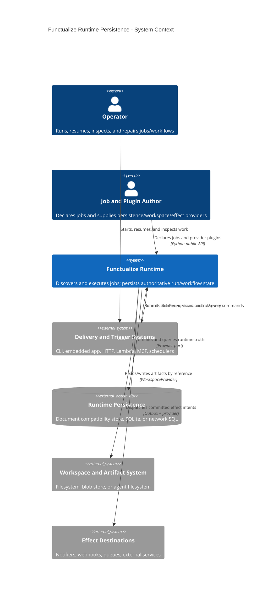

# C4 level 1 — system context

This diagram fixes the system boundary. Functualize owns orchestration and
runtime truth. It integrates with delivery triggers, provider-owned storage,
workspaces/artifacts, and effect destinations.

## Scope statements

- Runtime persistence contains execution causality: runs, workflow state,
  interactions, evidence metadata, leases, and outbox intent.
- Job code and delivery adapters are inside the Functualize runtime system but
  outside the persistence component boundary.
- Artifact bytes and the virtual/physical filesystem are external capabilities;
  runtime persistence records references.
- A concrete database is replaceable. The semantic model and query/control
  surfaces are part of Functualize.
