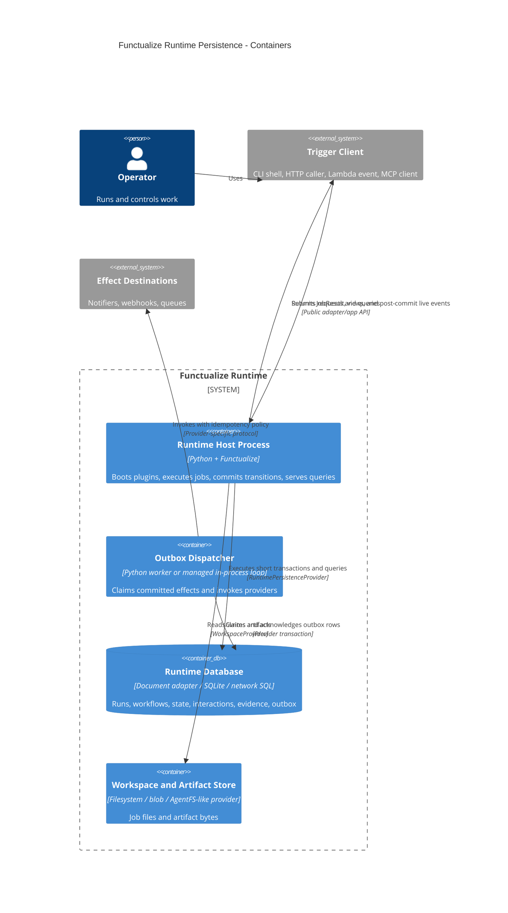

# C4 level 2 — containers

“Container” uses the C4 meaning: an executable/runtime or data store. Python
packages and plugins loaded into the same process are components, not containers.

## Container notes

- Local mode may run the dispatcher synchronously after commit in the host
  process. It remains a separate responsibility and can later become a worker
  without changing the outbox contract.
- The runtime database is one logical container even when the compatibility
  provider maps it to several files.
- The workspace store may share a physical SQLite file with runtime data in a
  local deployment, but it stays a separate logical container/capability.
- Delivery plugins embedded in the host do not own runtime persistence. They
  use the app facade.
