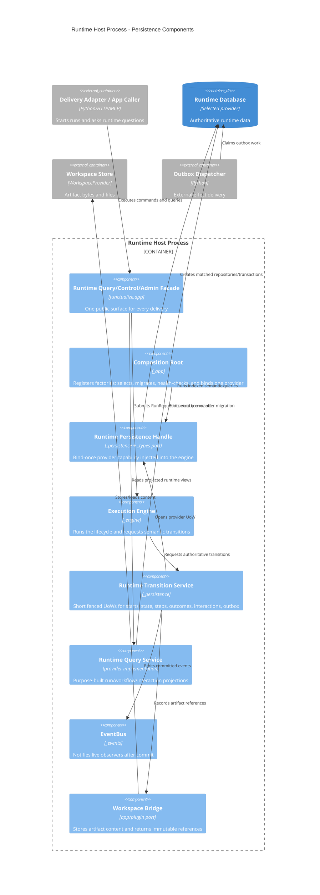

# C4 level 3 — runtime host components

This view zooms into the `Runtime Host Process` container. It shows ownership,
not a proposed class-per-box implementation.

## Dependency rule

The engine names only protocols/DTOs from `_types`. `_persistence` implements
backend-neutral orchestration without importing `_engine`. `_app` is the only
component that sees the engine, registry, config, and concrete provider together.
Public delivery code talks to `app_facade`; it never follows
`app.execution_engine.substrate`.
