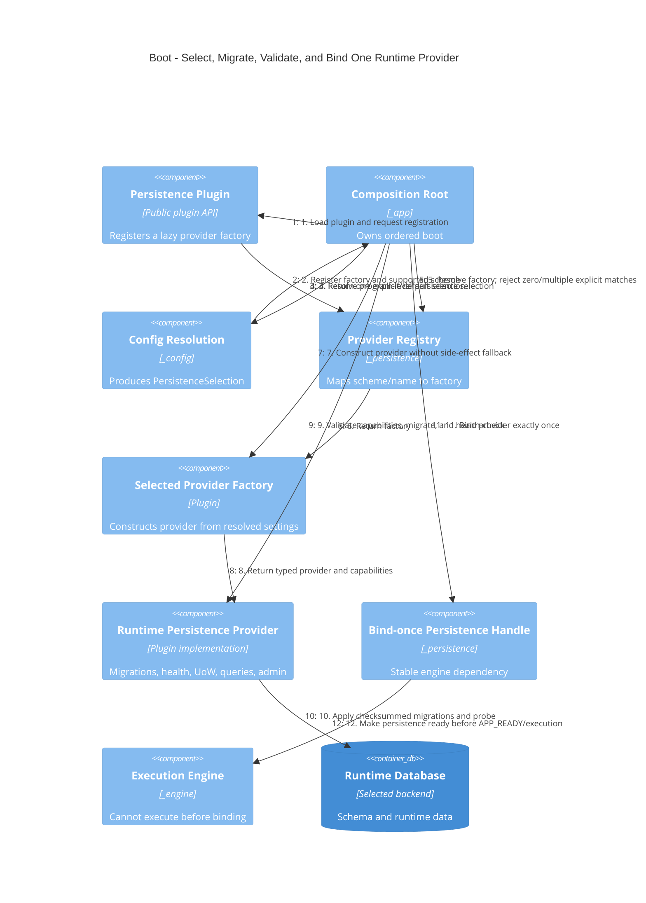

# C4 dynamic — provider boot and binding

## Failure semantics

- No explicit selection: bind the document compatibility provider.
- Explicit selection whose plugin/driver is absent: fail boot and name the
  install/config remedy.
- Migration/health failure: fail boot; never fall back to a local backend.
- Second bind: programming/configuration error.
- Static boot: uses an explicitly provided provider/factory or the zero-I/O
  document compatibility provider; it performs no entry-point scan.
