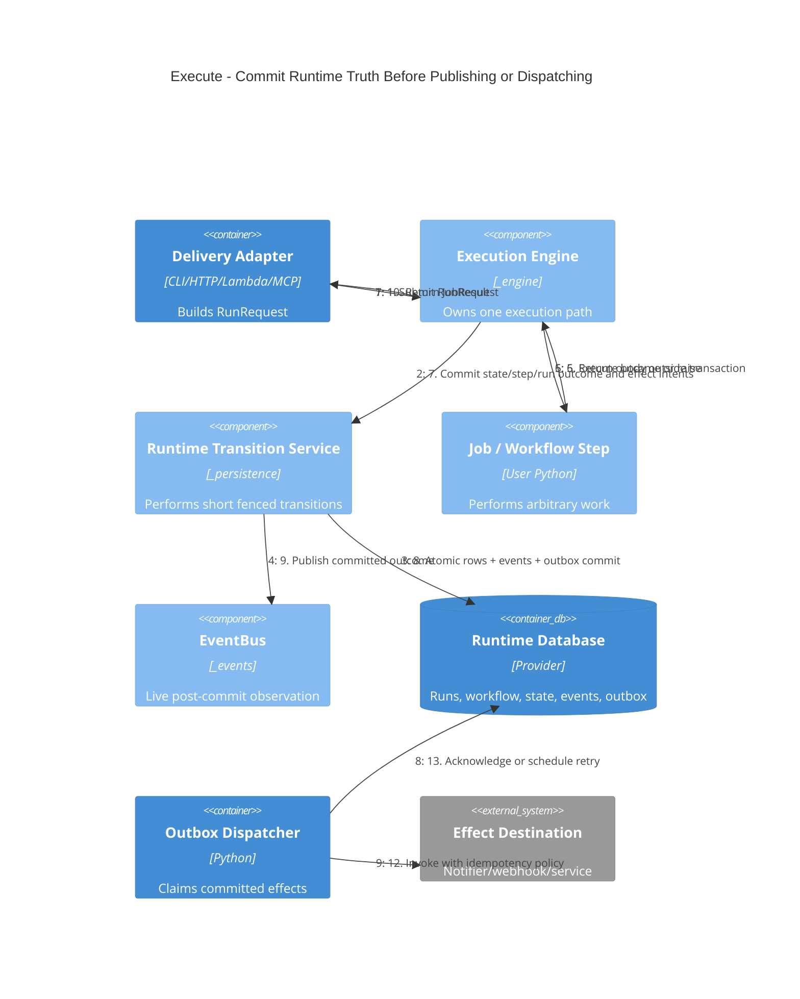

# C4 dynamic — execution and durable effects

The flow uses multiple short transactions. The job body and external effects do
not run inside one.

## Consequences

- A database failure while committing authoritative outcome is visible; it is
  not swallowed as optional observation.
- A live-rendering subscriber may fail without changing committed truth.
- A process crash after step commit cannot lose the effect intent.
- A process crash during the job leaves a started run/lease that recovery can
  classify and reclaim.
- Database retry wraps only a transition callback. It never repeats the job body
  or an external effect.
