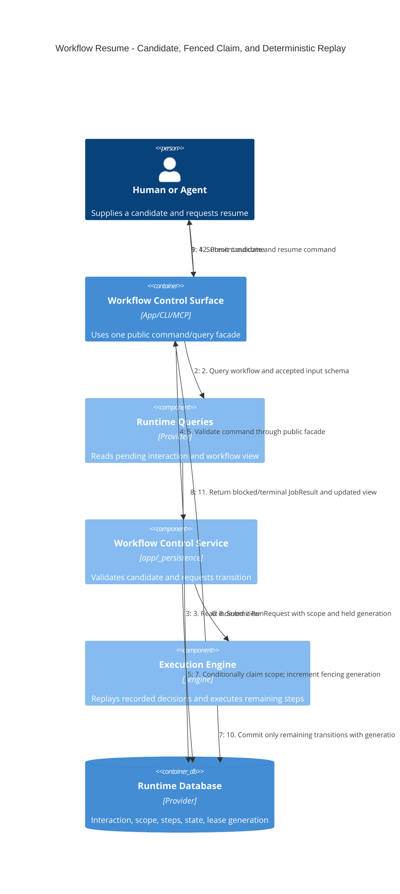

# C4 dynamic — suspend, claim, and resume

## Race rule

Two runners may both believe an expired scope is claimable. Only the conditional
claim returns a new generation. Every later write includes that generation, so
the loser—and a previously suspended old owner—cannot commit. Determinism comes
from persisted branch/step/interaction decisions, not re-evaluating them on
resume.
