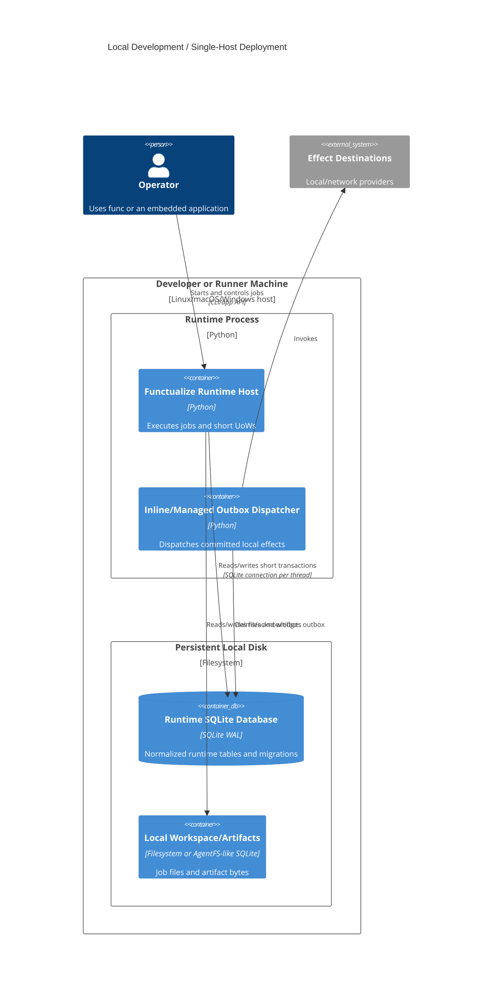

# C4 deployment — local SQLite

## Supported envelope

- Multiple threads and processes on the same host/file are supported within
  SQLite's writer limits, with WAL, busy timeout, short transactions, and
  fencing.
- A persistent local volume is required.
- The file must not be placed on an eventually consistent/object-store mount.
- SQLite does **not** satisfy multi-machine runtime capability. Copying or
  syncing the file is backup/replication, not shared concurrent execution.
