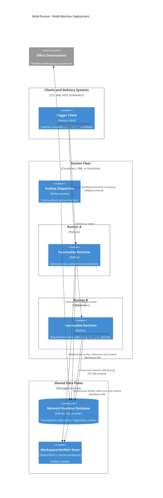

# C4 deployment — distributed runners

## Required provider properties

- server-coordinated transactions/row claims or equivalent compare-and-swap;
- fencing generation enforced in every authoritative write;
- migration lock safe across hosts;
- transient-error classification with bounded retry around database-only work;
- explicit isolation-level validation;
- shared time semantics for lease expiry, or conservative expiry plus fencing;
- connection pool sizing and shutdown lifecycle;
- outbox claim visibility/recovery after worker death.

The first implementation must name its database and test these properties.
“SQL compatible” is not a sufficient capability statement.
