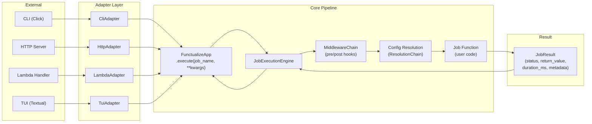
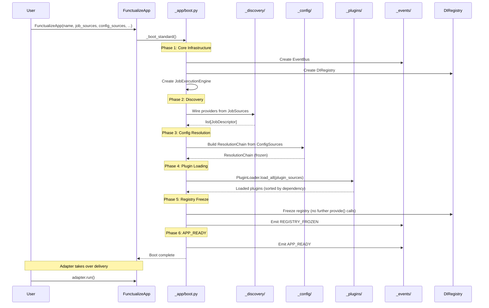
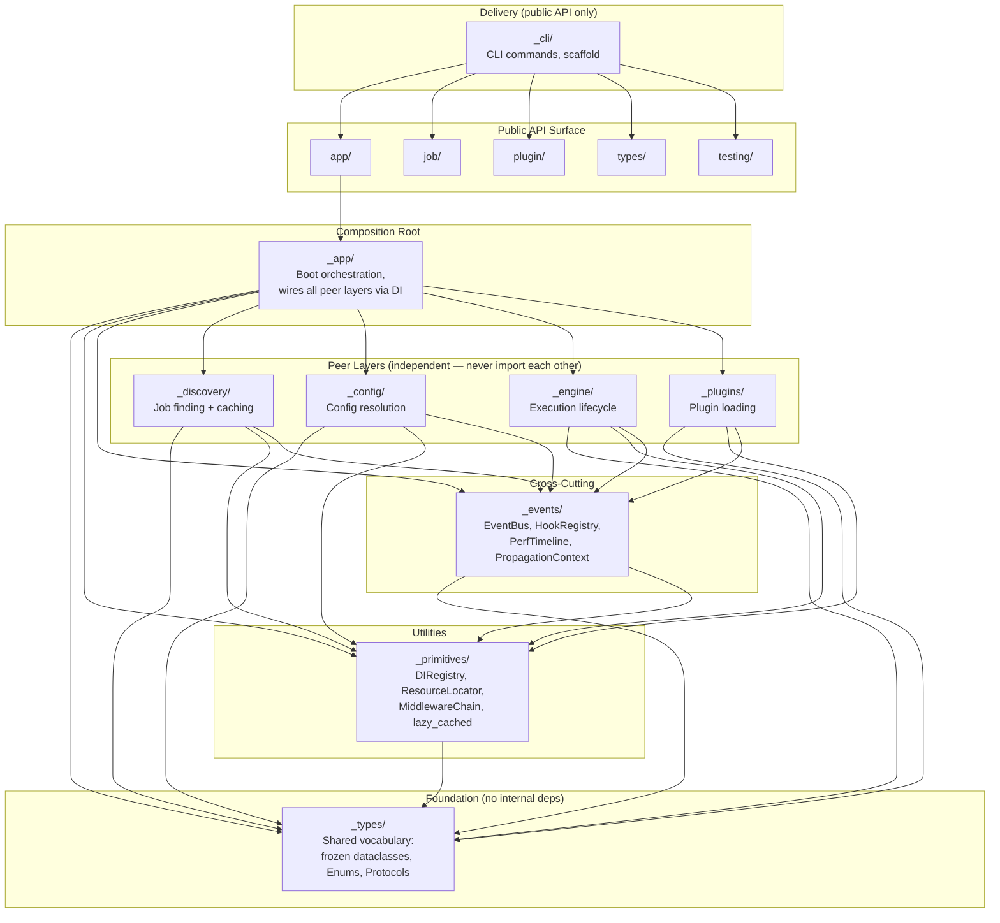
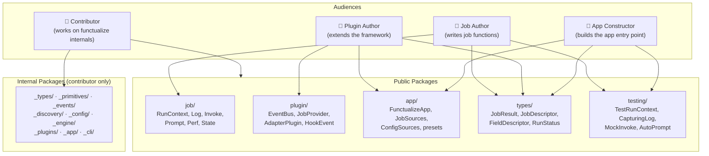
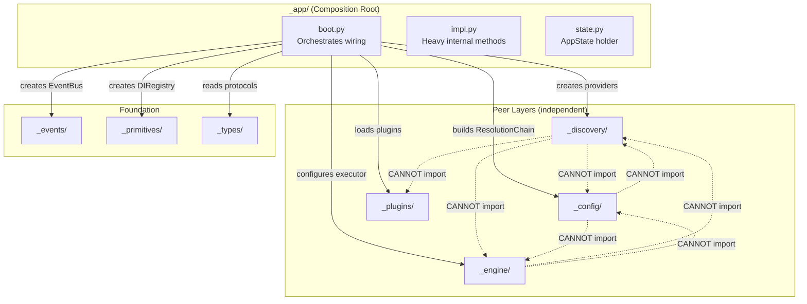

# Architecture

This guide describes how functualize is structured internally. Understanding the architecture helps when building plugins, debugging boot issues, or extending the framework.

!!! note "For Framework Contributors"
    If you're modifying functualize's internals, see `contributor/architecture/overview.md` for a terser, framework-contributor-focused version of this content optimized for understanding the framework's core layers and internal module structure.

---

## Mental Model

> **functualize is a pipeline that discovers, configures, and executes job functions through pluggable adapters.**

Think of it as three stages:

1. **Discovery** — find job functions in directories, modules, or static registrations
2. **Configuration** — resolve each job's config from CLI args, environment, files, and defaults
3. **Execution** — run the job function with a fully-wired `RunContext`, emitting lifecycle events

Adapters (CLI, HTTP, Lambda, TUI) sit at the edges — they translate external requests into `execute(job_name, **kwargs)` calls and render results back to the user. The kernel knows nothing about Click, HTTP frameworks, or terminal UIs.

---

## Data Flow

This diagram shows the complete request lifecycle from an external trigger through to the final result.



Key points:
- All adapters funnel through the same `FunctualizeApp.execute()` entry point
- The engine applies middleware (hooks, observability, error handling) around the job call
- Config resolution happens per-execution using the `ResolutionChain` built at boot time
- The job function receives a fully-configured `RunContext` with DI, logging, and event capabilities

---

## Boot Sequence

The boot process wires all subsystems in a deterministic order. Steps must not be reordered — later steps depend on earlier ones being complete.



| Step | Phase | What happens |
|---|---|---|
| 1 | `core_infra` | `EventBus`, `DIRegistry`, `JobExecutionEngine` instantiated |
| 2 | `provider_registry` | `TomlFormatProvider` registered — the only built-in default since ADR-007 |
| 3 | `observability` | `MiddlewareStack` created (before plugins so plugins can subscribe) |
| 4 | `plugins` | Entry-point and file-based plugins loaded via `PluginLoader.load_all()` |
| 5 | `config_entry_points` | Format and remote providers from entry points discovered |
| 6 | `config_resolution` | `ResourceLocator` and `ResolutionChain` built once; all config lookups reuse them |
| 7 | `job_registration` | Providers from `JobSources` wired (directories → `CachedDirectoryScanProvider`, functions → `StaticProvider`) |
| 8 | `children` | Child `FunctualizeApp` projects mounted via `ChildProjectLoader` |
| 9 | `registry_frozen` | DI registry frozen — no further `provide()` calls. `REGISTRY_FROZEN` event emitted |
| 10 | `app_ready` | `APP_READY` hook fires — all boot steps complete |
| 11 | `adapter.run()` | Active adapter (CLI, HTTP, Lambda, TUI) takes over delivery |

Config files are parsed **once at boot** — there is no per-invocation file I/O.

On application exit, plugins implementing `PluginWithShutdown` have their `on_shutdown()` called in reverse loading order (5-second per-plugin timeout).

---

## Layer Dependency Graph

functualize enforces strict layer dependencies via `import-linter`. Each layer may only import from layers below it in the graph. Violations are caught in CI.



### Layer rules summarized

| Layer | May import from | Must NOT import from |
|-------|----------------|---------------------|
| `_types/` | stdlib only | Any `_`-prefixed package |
| `_primitives/` | `_types/`, stdlib | `_events` through `_cli` |
| `_events/` | `_types/`, `_primitives/` | `_discovery` through `_cli` |
| Peer layers (`_discovery`, `_config`, `_engine`, `_plugins`) | `_types/`, `_primitives/`, `_events/` | Each other, `_app`, `_cli` |
| `_app/` | All internal layers | `_cli`, any public folder |
| `_cli/` | Public folders only | Any `_`-prefixed package |

---

## Audience Diagram

Different audiences interact with different packages. This diagram shows which imports each role uses.



### What each audience imports

| Audience | Primary imports | Example |
|----------|----------------|---------|
| **Job author** | `functualize.job`, `functualize.types` | `from functualize.job import RunContext, Log, Invoke` |
| **Plugin author** | `functualize.plugin`, `functualize.types` | `from functualize.plugin import EventBus, JobProvider, AdapterPlugin` |
| **App constructor** | `functualize.app`, `functualize.types` | `from functualize.app import FunctualizeApp, JobSources, classic` |
| **Test writer** | `functualize.testing` | `from functualize.testing import TestRunContext, CapturingLog` |
| **Contributor** | Internal `_`-prefixed packages | `from functualize._engine.capabilities.invoke import Invoke` |

---

## Composition Root Pattern

The `_app/` package is the **sole composition root** — the only place where peer layers are wired together. No peer layer knows about any other peer layer.



**Why this matters:**
- Adding a new discovery provider doesn't require touching config or engine code
- Plugin loading can be tested in complete isolation from job discovery
- The boot sequence in `_app/boot.py` is the single place to understand how everything connects
- Changing wiring logic (e.g., swapping a provider) is localized to one file

---

## Config Resolution

Configuration is resolved with a fixed precedence. The first non-`None` value wins.

```
CLI args  >  Environment variables  >  Config files  >  Defaults
```

| Source | Implementation | Notes |
|---|---|---|
| CLI args | Click option parsing | Passed as `kwargs` to the job function |
| Environment variables | `EnvSource` | Variables named `<APP>_<SECTION>_<KEY>` |
| Config files | `FileSource` + format providers | TOML by default; pluggable |
| Defaults | `DefaultSource` | Pydantic field `default` / `default_factory` |

**Key components:**

- `ResolutionChain` — consults `Source` implementations in order; records provenance for each resolved value
- `ResourceLocator` — walks upward from CWD to find config files; never uses hard-coded paths
- `JobConfigView` — wraps `ResolutionChain` plus in-memory overrides; injected into `RunContext`
- Format providers — pluggable parsers registered via entry points or a plugin. TOML is the only one registered by default; `IniFormatProvider` ships in-tree and must be registered explicitly (ADR-007), which a plugin can do because plugins load before the resolution chain is built

---

## Interactivity Layer

The interactivity layer decouples job execution from any specific UI through two protocol-based channels: output rendering and input collection.

### Output channel — the Surface protocol

`JobExecutionEngine` fans every non-framework event out to all registered
`Surface` instances (`handle_event(event)`):

```
JobExecutionEngine
      |  handle_event(StructuredEvent)     [Surface]  (e.g. the TUI panel,
      +--------------------------------->            StdoutSurface, flow-viz,
      |                                              a job-owned TextualApp,
      +--------------------------------->            a log-file recorder)
```

While a job owns the screen (an EXCLUSIVE window), other terminal-drawing
surfaces are skipped; headless surfaces (`needs_terminal = False`) keep receiving.

### Input channel — the PromptCollector protocol

When a job calls `rc.prompt_*()`, the framework routes to exactly one active
`PromptCollector` (top of the surface stack), falling back to a TTY-gated stdin
collector:

```
[Job Function] → rc.prompt_confirm(...) → [RunContext]
      → active PromptCollector.collect(request) → PromptResponse
        (inline TUI, a job app's modal, stdin fallback, MCP gate)
```

### Job-owned UIs — the TTY and Live capabilities

A job declares where it renders in its signature (harvested statically into the
descriptor cache): `tty: TTY` grants terminal ownership for a job-owned Textual
app (`tty.run(app)`, refused off a terminal), and `live: Live` mounts a live
`LiveConstruct` into the active surface's live zone (`live.add(construct)`).

### Custom event emission — rc.emit()

Jobs emit custom structured events that reach the `EventBus` and every registered
`Surface`:

```python
rc.emit("pipeline.stage.complete", resource="extract", records=1000)
```

Framework lifecycle events (`job.execute.*`, `job.teardown.*`, `plugin.*`,
`config.*`, `cli.*`, `tui.*`) are filtered out — they never reach a `Surface`.

Exceptions inside `handle_event` are **swallowed with a warning** — one bad
surface never interrupts a job or starves its peers.

---

## Extension Points Summary

| Extension point | Interface | Registered via | Purpose |
|---|---|---|---|
| **Hooks** | `HookRegistry.register()` | Code (`app.hooks.register(...)`) | Callbacks at lifecycle points |
| **DI Registration** | `app.provide()` / `provide_factory()` / `provide_named()` | Code (from plugins during boot) | Register typed capabilities for DI injection |
| **Plugins** | `PluginMetadata` protocol + callable | Python entry points (`functualize.plugins`) | Add CLI commands, register providers, subscribe to events |
| **Adapters** | `AdapterPlugin` Protocol | `adapter(app); adapter.run()` | Delivery surfaces: CLI, HTTP, Lambda, custom |
| **Surface** | `Surface` protocol (`handle_event`) | `app.register_surface(obj)` | Render a job's events |
| **PromptCollector** | `PromptCollector` protocol (`collect`) | `app.register_surface(obj)` | Answer `rc.prompt_*()` |
| **Job UI capabilities** | `tty: TTY` / `live: Live` params | declared in the job signature | Own the terminal / mount a live construct |
| **Job Providers** | `JobProvider` Protocol | `app.add_job_provider(provider)` | Custom job discovery sources |
| **Job Transforms** | `JobTransform` Protocol | `app.add_job_transform(transform)` | Intercept and modify job descriptors |
| **EventBus** | `app.event_bus.emit / subscribe` | Code | Structured publish-subscribe |
| **Middleware** | `MiddlewareChain` (yield-based generators) | Code | Wrap execution at named operation points |
| **Format providers** | `FormatProvider` protocol | Entry points or `provider_registry` | Support for new config file formats |
| **StateStore** | `StateStoreProtocol` protocol | `scope.replace_state_store(impl)` | Pluggable state storage backends |
