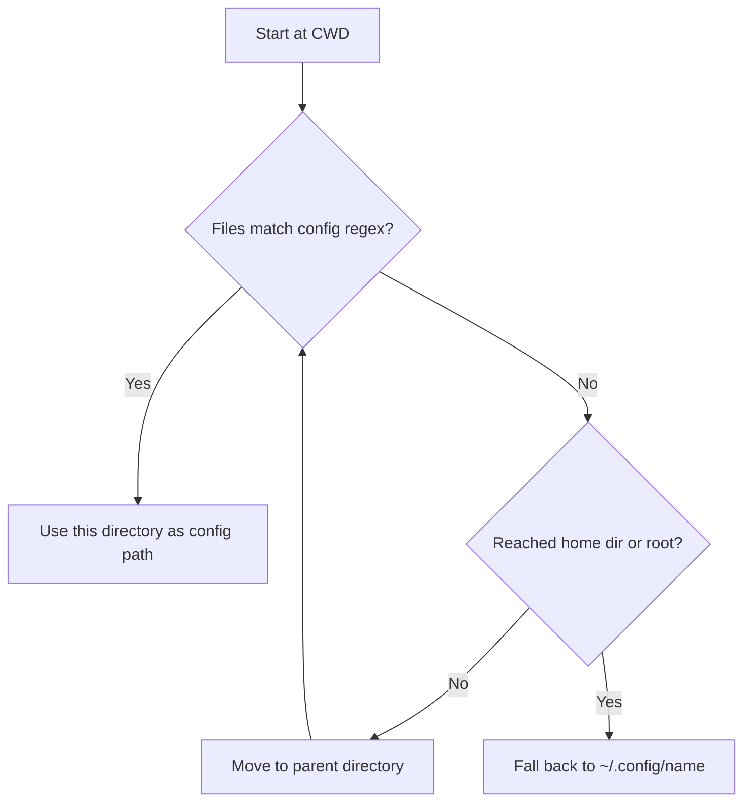
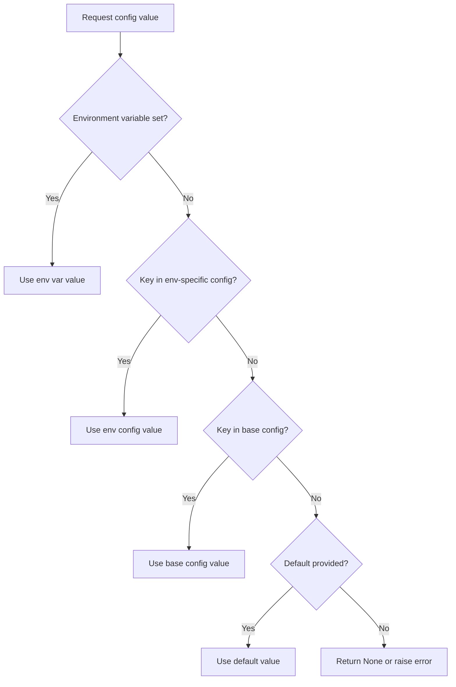
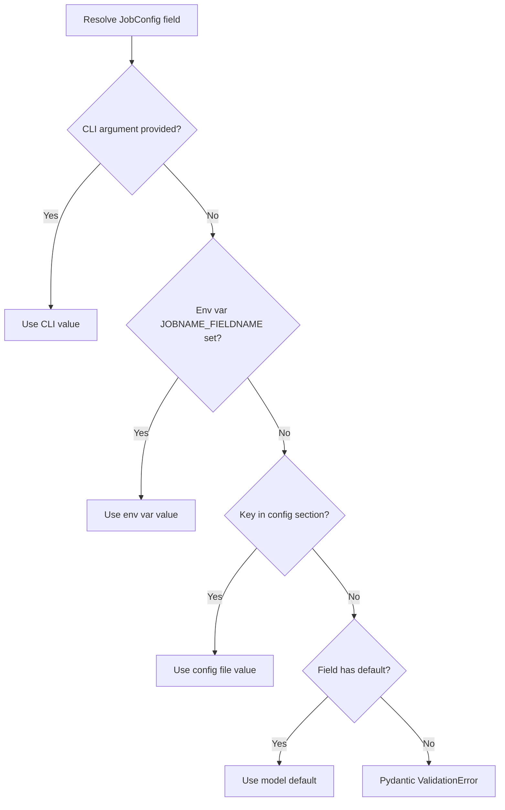
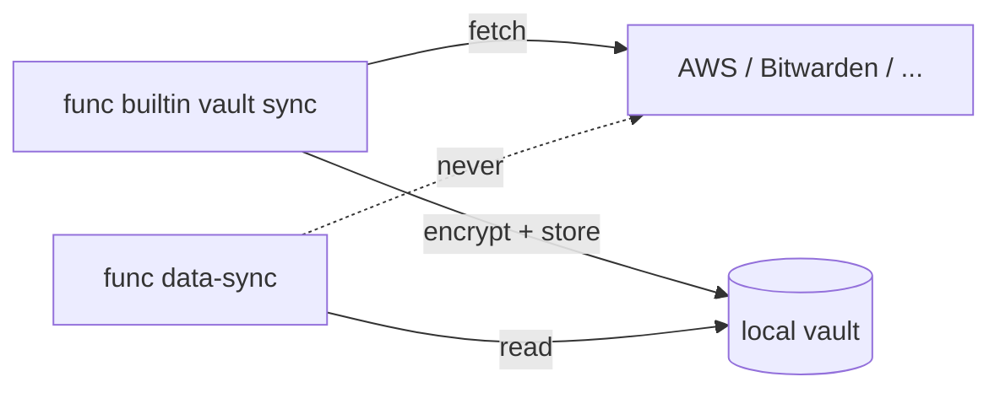

# Configuration System

Functualize uses a layered TOML-based configuration system that resolves values from multiple sources with a clear priority order. This guide covers how config files are discovered, how values are resolved, how to use per-job configuration sections with Pydantic models, and how to declare a credential.

## Overview

The configuration system provides:

- **Preset factory functions** — named configuration strategies (`classic`, `twelve_factor`, `env_only`, `remote_first`)
- **Upward directory search** for config files starting from the current working directory
- **Base + environment overlay** pattern using TOML files
- **Environment variable precedence** over file-based config
- **Per-job sections** that map directly to `JobConfig` Pydantic models
- **Tracking** of which settings were accessed and where values came from
- **[Credentials](#credentials)** declared with `Secret[str]`, masked on every surface that renders configuration
- **[Remote configuration](#remote-configuration)** — values declared as `aws-sm://prod/db-password`, synced into an encrypted local vault

## Configuration Presets

Functualize provides preset factory functions that return a `ConfigSources` instance configured for common deployment scenarios:

```python
from functualize.app import FunctualizeApp, JobSources, classic, twelve_factor, env_only, remote_first

# Classic: CLI → Env → Files (upward search) → Defaults (the default behavior)
app = FunctualizeApp(name="myapp", config_sources=classic())

# Twelve-factor: CLI → Env → Defaults (no file discovery)
app = FunctualizeApp(name="myapp", config_sources=twelve_factor())

# Env-only: CLI → Env → Defaults (minimal, with optional dotenv)
app = FunctualizeApp(name="myapp", config_sources=env_only(dotenv=True))

# Remote-first: CLI → Vault → Env → Files → Defaults
app = FunctualizeApp(name="myapp", config_sources=remote_first())
```

!!! info "`remote_first()` requires a provider plugin"
    It resolves declared `provider://reference` annotations from the project's
    encrypted local vault, which `func builtin vault sync` fills. Selecting it
    with **no** remote provider registered raises at construction rather than
    quietly resolving from local files. See
    [Remote Configuration](#remote-configuration).

    Before 0.2.4 this preset silently *was* `classic()`: it returned
    `config_resolution_chain=None` and no boot path built a remote source, so
    an operator choosing it for AWS Secrets Manager got local files and
    environment variables with no warning.


When no `config_sources` is specified, the default behavior is identical to `classic()`.

You can also create custom presets — any function returning a `ConfigSources` instance works:

```python
from functualize.app import ConfigSources

def my_custom_preset(**kwargs) -> ConfigSources:
    return ConfigSources(dotenv=True, file_pattern=r"^app_config\.(\w+)\.toml$")
```

## Config Directory Discovery

When a `FunctualizeApp` is instantiated, it discovers the config directory by searching upward from the current working directory for files matching a regex pattern.

```python
from functualize.app import FunctualizeApp, JobSources

app = FunctualizeApp(
    name="myapp",
    job_sources=JobSources(directories=["jobs"]),
)
```

The `name` parameter serves as the fallback identifier. If no config files are found during the upward search, Functualize falls back to `~/.config/<name>/` (for example `~/.config/myapp/`). This XDG-style path is used on every platform — `discover_config_path` returns `Path.home() / ".config" / name` directly, without any OS-specific branch.

### Upward Directory Walk

The discovery algorithm works as follows:

1. Start at the current working directory (`os.getcwd()`)
2. List files in the current directory and match against the config file regex
3. If matches are found, use that directory as the config path
4. If no matches, move to the parent directory and repeat
5. Stop at the user's home directory (`~`) or the filesystem root (`/`), whichever is reached first
6. If no matches are found anywhere, fall back to `~/.config/<name>/`



!!! info "CLI Override"
    The `--config-directory` global CLI option overrides the discovered config path entirely. When provided, no upward search is performed.

## Config File Pattern

By default, Functualize looks for files matching the regex pattern:

```
^config\.(\w+)\.(\w+)$
```

This matches filenames like `config.base.toml`, `config.dev.toml`, `config.prod.toml`, etc.

### Custom Regex Pattern

You can customize the pattern via the `file_pattern` in `ConfigSources`:

```python
from functualize.app import FunctualizeApp, JobSources, ConfigSources

app = FunctualizeApp(
    name="myapp",
    job_sources=JobSources(directories=["jobs"]),
    config_sources=ConfigSources(file_pattern=r"^settings\.(\w+)\.toml$"),  # matches settings.base.toml, etc.
)
```

The regex is applied to filenames (not full paths), both when anchoring the config directory during the upward walk and when the file source selects which files to parse. Files still need an extension that a registered format provider handles — `.toml` alone by default. A plugin can register more by calling `app.config_registry.register_format_provider(...)`, or a package can declare one in the `functualize.format_providers` entry-point group.

## Base Config and Environment Overlays

Functualize loads configuration in two layers:

1. **Base config** — `config.base.toml` (always loaded first)
2. **Environment overlay** — `config.{env}.toml` (merged on top of base)

The environment name comes from the first of these that is set to a valid name, defaulting to `"DEV"`:

1. `FUNCTUALIZE_ENV`
2. `ENVIRONMENT`
3. `ENV`

A value that is blank, or that isn't a valid filename segment (`[A-Za-z0-9_-]+`), is skipped rather than being an error — the next variable is tried. This matters for `ENV` in particular: POSIX `sh`/`ksh` set it to the path of a startup file, which is not an environment name.

Matching is **case-insensitive**, comparing the environment name against the file's slot. The filename is not lowercased, so `config.Prod.toml` is selectable too.

| Environment value | Overlay file loaded |
|---------------------|---------------------|
| *(not set)* | `config.dev.toml` |
| `DEV` | `config.dev.toml` |
| `PROD` | `config.prod.toml` |
| `STAGING` | `config.staging.toml` |

A file naming any *other* environment is discovered but never merged. `func`'s inline TUI lists it as `○ inactive`, so a file that plainly exists but isn't taking effect is visible rather than mysterious.

!!! note
    The overlay is deep-merged on top of the base config through the file's registered `FormatProvider` — the mechanism is format-agnostic rather than tied to any one parser, so a format a plugin registers behaves the same way. Keys in the overlay override the same keys in the base file; keys only present in the base file are preserved.

!!! note "Precedence across directories"
    When config files exist in several directories (project, parents, global), the **nearest directory wins overall**, and within a single directory the overlay beats that directory's base. A project's `config.base.toml` therefore still outranks a global `config.prod.toml` — the ladder is about *whose* config it is, not which environment it names.

## Resolution Priority

Configuration values are resolved with the following priority (highest to lowest):



### Environment Variable Convention

Environment variables follow the `SECTION_KEY` naming convention — both the section name and key name are uppercased and joined with an underscore.

| Section | Key | Environment Variable |
|---------|-----|---------------------|
| `server` | `api_url` | `SERVER_API_URL` |
| `database` | `host` | `DATABASE_HOST` |
| `general` | `debug` | `GENERAL_DEBUG` |

When the section is an empty string, only the key name (uppercased) is used as the environment variable name.

## Environment Variables and `.env` Files

Functualize resolves environment variables from `os.environ` at config resolution time. A `.env` file can populate `os.environ` with additional values in two ways: the `--dotenv-file` CLI flag, or the app's `ConfigSources.dotenv` / `dotenv_path` settings, which boot honors before building the resolution chain.

### How `.env` Loading Works

```bash
# Explicit: load .env before config resolution runs
myapp --dotenv-file .env data-sync run

# No flag: loading depends on the app's ConfigSources (see below)
myapp data-sync run
```

When `--dotenv-file` is passed, the CLI adapter calls `python-dotenv`'s `load_dotenv()` in the root group callback — **before** any subcommand executes and before config resolution runs. This means `.env` values are available in `os.environ` by the time the resolution chain reads them.

Independently of the flag, application boot loads a `.env` file when `ConfigSources.dotenv` is true (the dataclass default) or `ConfigSources.dotenv_path` names a file — at the very start of both boot paths, so `EnvSource` sees the values. Loading always uses `override=False`: values already in the environment win.

```python
from functualize.app import FunctualizeApp, ConfigSources
from functualize.app.presets import env_only, twelve_factor

app = FunctualizeApp("myapp")                                    # dotenv=True default: loads ./.env if present
app = FunctualizeApp("myapp", config_sources=ConfigSources(dotenv=False))  # never loads
app = FunctualizeApp("myapp", config_sources=env_only(dotenv_path=".env.local"))  # explicit path
app = FunctualizeApp("myapp", config_sources=twelve_factor())   # dotenv=False default: pure 12-factor
```

### How `.env` Affects Config File Selection

Because `.env` is loaded into `os.environ` before boot runs, it can influence **which config files** get loaded. The `ENVIRONMENT` variable (read from `os.environ` during boot) controls the environment overlay:

```bash
# .env file
ENVIRONMENT=prod
DATA_SYNC_API_URL=https://api.prod.example.com
```

```bash
# This loads .env → sets ENVIRONMENT=prod → boot loads config.base.toml + config.prod.toml
myapp --dotenv-file .env data-sync run
```

Without `--dotenv-file`, the `ENVIRONMENT` variable must be set in the shell:

```bash
# Shell sets ENVIRONMENT directly
ENVIRONMENT=prod myapp data-sync run
```

In both cases, the config system loads `config.base.toml` first, then merges `config.prod.toml` on top (values in the overlay override the base).

### Precedence: Shell vs `.env`

Python-dotenv does **not** override existing shell environment variables by default. This means:

| Source | Priority | Example |
|--------|----------|---------|
| CLI flags | Highest | `--batch-size 2000` |
| Shell environment variables | High | `export DATA_SYNC_BATCH_SIZE=500` |
| `.env` file values (via `--dotenv-file`) | Medium | `DATA_SYNC_BATCH_SIZE=100` in `.env` |
| Config files (TOML) | Low | `batch_size = 50` in `config.base.toml` |
| Pydantic model defaults | Lowest | `Field(default=25)` |

If `DATA_SYNC_BATCH_SIZE=500` is already set in your shell, a `.env` file containing `DATA_SYNC_BATCH_SIZE=100` will **not** override it. The shell value wins.

This applies to the `ENVIRONMENT` variable too — if your shell has `export ENVIRONMENT=staging` and your `.env` has `ENVIRONMENT=prod`, the staging overlay is used because shell takes precedence.

### Boot-Time `.env` Loading Rules

Boot's `.env` handling is driven entirely by `ConfigSources`:

- `dotenv=True` (the `ConfigSources` default and the `env_only()` preset default): boot loads `./.env` from the current working directory if it exists — missing file is not an error.
- `dotenv_path="..."`: boot loads that specific file; a missing file logs a warning and skips.
- `dotenv=False` (the `twelve_factor()` preset default): boot never calls `load_dotenv()`.
- Loading happens at the very start of boot (both the standard and static paths), before the resolution chain is built.
- Only the current directory is checked — there is **no upward directory scan**, so a `.env` forgotten in a parent directory is never silently picked up.

For the `func` CLI, the resolved CLI config (`dotenv` / `dotenv_path` from `pyproject.toml` `[tool.functualize]`, `FUNCTUALIZE_DOTENV`, `FUNCTUALIZE_DOTENV_PATH`) controls loading, with `--dotenv-file` / `--no-dotenv` as overrides. The CLI default is `dotenv = false` — opt in per project.

!!! info "Disabling for reproducibility"
    Automatic `.env` loading can cause differences between environments. For CI or production, use `twelve_factor()` (or `ConfigSources(dotenv=False)`, or `--no-dotenv` on the CLI) so environment variables come only from the orchestrator.

### Practical Patterns

**Local development with `.env`:**

```bash
# Create a .env for local secrets
echo "DATA_SYNC_API_KEY=dev-secret-123" > .env
echo "DATA_SYNC_API_URL=http://localhost:8080" >> .env

# Run with dotenv
myapp --dotenv-file .env data-sync run
```

**CI/Docker (no `.env` needed):**

```bash
# Real env vars are set by the orchestrator
export DATA_SYNC_API_KEY=$VAULT_SECRET
export DATA_SYNC_API_URL=https://api.prod.example.com
myapp data-sync run
```

**Verifying what's loaded:**

```bash
# show-info displays whether a dotenv file was loaded and its contents
myapp --dotenv-file .env show-info
```

### Introspection with `show-info`

The `show-info` command reports the current dotenv status:

- If `--dotenv-file` was passed, it displays the file path and its key-value contents
- If no dotenv file was loaded, it prints a notice: "No dotenv file loaded"
- Use `--show-env-vars` to see the full `os.environ` snapshot (including any values injected from `.env`)

## Per-Job Config Sections

Each job can have its own config section where the section name matches the `JOB_NAME` value defined in the job module. When a job uses a `JobConfig` Pydantic model, fields are resolved from the matching section.

```toml
# config.base.toml

[general]
debug = false
log_format = "json"

[data_sync]
api_url = "https://api.example.com"
batch_size = 100
timeout = 30

[report_gen]
output_dir = "./reports"
format = "pdf"
```

In this example, a job with `JOB_NAME = "data_sync"` reads from the `[data_sync]` section.

## JobConfig Field Resolution

When a job function declares a `JobConfig` Pydantic model parameter, each field is resolved with this precedence:

1. **Runtime override** — a value deposited by `rc.config.set("batch_size", 200)` during the run
2. **CLI argument** — explicitly passed via the command line (e.g., `--batch-size 200`)
3. **Environment variable** — `JOBNAME_FIELDNAME` uppercased (e.g., `DATA_SYNC_BATCH_SIZE`)
4. **Config file section** — the `[job_name]` section in the loaded config files
5. **Model default** — the default value defined on the Pydantic field

An override outranks the command line: it is written after the command line was
read, and it is what the rest of the run reads back.



!!! warning
    If a required field (no default value) has no value from any source, an interactive surface asks for it. Off one — CI, a pipe, a cron job — Pydantic's `ValidationError` is reported with field-level details, the config files that were actually read, and the environment variable that would set the field.

## Credentials

A credential is an ordinary config field that you mark as secret. Nothing else
about it changes: it resolves through the same ladder, in the same section, under
the same environment variable name.

```python title="jobs/sync.py"
from pydantic import BaseModel, Field

from functualize.job import RunContext
from functualize.types import Secret


class SyncConfig(BaseModel):
    api_url: str = Field(default="https://api.example.com")
    credential: Secret[str] = Field(description="API token")


def sync(config: SyncConfig, rc: RunContext) -> None:
    rc.log(f"connecting to {config.api_url}")
    client.authenticate(config.credential.get_secret_value())
```

`Secret[str]` is the declaration. It is a real type: it validates from a plain
string, refuses to render its value in `str()`, `repr()` or a log line, serializes
to the mask in JSON (`model_dump_json()`, `model_dump(mode="json")`), and yields
the real value only through `.get_secret_value()`.

A plain `model_dump()` returns the `Secret` object itself rather than the mask.
That is deliberate: the framework passes config models between jobs by dumping
and rebuilding them — `rc.invoke(child, config=…)` is the common case — and
flattening the wrapper there would hand the child `•••` instead of the
credential, silently. The object still masks itself wherever it is rendered, so
nothing leaks by keeping it.

A field that must stay a plain `str` for some other reason can carry the marker
instead, and is treated identically everywhere:

```python
credential: str = Field(default="", json_schema_extra={"secret": True})
```

Both markers answer one question — *is this field a secret?* — asked in one
place. Every surface that renders configuration asks it: `func builtin info
--job`, `func builtin env`, the inline TUI's config table and source-chain
view, and the bar while you type into the field. None of them will show you the
value.

!!! warning "Detection is by declaration, never by name"
    A field called `sort_key` is not a secret, and a field called `x` is one if
    you declared it so. Name matching was tried and removed: it masked the wrong
    fields and, far worse, left real credentials in cleartext whenever the name
    did not match a pattern.

### Finding out what a job needs

```console
$ SYNC_CREDENTIAL=hunter2-real func builtin env sync
export SYNC_API_URL=https://api.example.com  # source: file
export SYNC_CREDENTIAL='•••'  # source: env
```

The comment names the *kind* of source a value came from — `file`, `env`, `cli`,
`default` — not the particular file. A plain value is printed unquoted; the mask
is quoted because it is not a value you could paste back.

Unset fields come back commented, so the output doubles as a `.env` skeleton and
"is the credential configured?" has a visible answer:

```console
$ func builtin env strict
# STRICT_TOKEN=  # REQUIRED — not set
```

`func builtin env <job> -- <command>` runs a command with the resolved values in
its environment instead of printing them. Secret fields are **masked** in the
print form and **omitted** from the exec environment unless you pass
`--include-secrets`, so the default output is safe to paste into a bug report
while the exec form never puts a credential in a child process it did not ask
for.

### Where credentials come from

Set them in the environment, or in a `.env` file that is not committed — or
name a remote secret store with an annotation, covered in
[Remote Configuration](#remote-configuration).

A `${env:VAR}` interpolation syntax was considered and **rejected**, and that
decision stands. It reads as indirection but resolves to the same environment
variable the field would have read anyway — so it adds a syntax, a parse step
and a failure mode, and buys nothing except the appearance of a secrets
feature. That appearance is the danger: it invites putting the real value there
"just for now". A field that resolves from the environment does so because that
is the ladder, not because a config file pointed at it.

An annotation is a different thing, and the difference is the whole reason it
was accepted where `${env:VAR}` was not: `aws-sm://prod/db-password` names a
location the config file could not otherwise reach, and nothing about it
tempts anyone to paste a password in its place. It names **where** a credential
lives and never carries its **value** (ADR-016).

There is no `[secrets]` section. A credential is a field in its job's own
section, marked secret — one concept, not two.

## Remote Configuration

A config value can name **where** a credential lives instead of carrying it:

```toml title="config.base.toml"
[data-sync]
password = "aws-sm://prod/db-password"
api_token = "aws-ssm:///platform/api-token"
webhook   = "bws://8a9c2f0e-1b3d-4c5e-9f70-2a1b3c4d5e6f"
region    = "eu-west-1"                      # an ordinary value, untouched
docs_url  = "https://docs.example.com"       # an ordinary URL, untouched
```

Two rules make that safe to put in a committed file:

- The annotation names a **location**, never a **value**. Reading the file
  tells you a credential exists and which store holds it, which is what the
  file previously could not say at all.
- A value is an annotation only when its scheme matches a **registered
  provider**. `https://docs.example.com` stays a string because no plugin
  registers `https`.

### The vault, and why reads never hit the network

Values are fetched by `func builtin vault sync` and written to a per-project
encrypted store. A job run reads that store and **never** the network.

That is a deliberate trade (ADR-016). Resolving annotations live would put a
network round-trip and a 30-second timeout between the operator and every job
run, including runs of jobs that use no secret at all — and it would stop you
working offline. Here the network is touched when *you* sync.



Only the **value** is encrypted. `key`, `annotation`, `provider` and
`synced_at` are stored in clear on purpose, so `vault list` can report what is
held and how fresh it is on a machine that cannot open the store. None of them
is the secret: knowing that `data-sync.password` came from
`aws-sm://prod/db-password` reveals nothing the config file did not already say
out loud.

Each project gets its own vault, keyed the same way the discovery cache is. A
repository you cloned to look at cannot read the secrets of a project you
actually work on.

### Getting started

```bash
# 1. Install a provider plugin.
pip install functualize-aws          # aws-sm, aws-ssm
pip install functualize-bitwarden    # bws

# 2. Create a vault key and keep it somewhere your shell can read.
export FUNCTUALIZE_VAULT_KEY=$(func builtin vault keygen)

# 3. Declare annotations in your config file, then fill the vault.
func builtin vault sync

# 4. Run jobs as usual. Nothing else contacts the network.
func data-sync
```

Select the preset in your `main.py`:

```python
from functualize.app import FunctualizeApp, JobSources, remote_first

app = FunctualizeApp(
    name="my-platform",
    job_sources=JobSources(directories=["my_platform.jobs"]),
    config_sources=remote_first(),
)
```

### Where the vault sits in the chain

`remote_first()` builds **CLI → Vault → Env → Files → Defaults**. A synced
secret outranks the environment and the config file; an explicit CLI argument
still wins.

Note what that means in practice: once `data-sync.password` is in the vault, an
environment variable no longer overrides it. That is the preset's whole
proposition — the value comes from the store you named — but it is a change
from `classic()` worth knowing before you switch.

### The key

The vault key is resolved by a `VaultKeyProvider`, non-interactive sources
first:

| Provider | Source | Interactive |
|---|---|---|
| `env` | `$FUNCTUALIZE_VAULT_KEY` (64 hex characters) | no |
| `keychain` | the OS keyring | yes |

The environment wins **when set**, so an automated run is deterministic and
never blocks on a prompt. Interactive providers are consulted only on a real
terminal — a Lambda must not hang on a keychain dialog.

With no key at all the vault does not open. There is **no plaintext fallback**:
resolution falls through to the next source, and says so.

### Three things that warn rather than fail

Offline work has to keep working, so none of these stops a run.

**A key declared remotely with nothing synced for it.** Resolution continues to
the next source, and the warning names the key, its annotation, which source
answered instead, and the fix:

```
Config key 'data-sync.password' is declared remotely as
'aws-sm://prod/db-password', but the vault holds no synced value for it. The
job will receive the literal annotation string from
file (/srv/my-platform/config.base.toml), not the secret it names. Run
`func builtin vault sync` to fill the vault.
```

That is also what a **first run** looks like — a key exported and `vault sync`
not yet run. It warns per declared key rather than once, because unlike a
missing key it has a one-command fix the message can name.

Once per key per run, not once per access.

**A stale vault.** Past `max_age` (default `24h`, judged on the oldest entry)
the first vault read of a run warns once and the run continues:

```python
config_sources=remote_first(max_age="7d")
```

`$FUNCTUALIZE_VAULT_MAX_AGE` overrides that. Durations are
`<number><unit>` terms — `30s`, `45m`, `24h`, `7d`, `2w`, or `1d12h`. A bare
number is refused rather than guessed, and so is `1M`: a month has no fixed
length, and reading it as minutes would be wrong by a factor of 43,200.

**An annotation whose plugin is not installed.** `aws-sm://prod/db` with
`functualize-aws` absent is reported by `vault sync` rather than passed over,
because the alternative is a job receiving the literal string as its password.

### The `builtin vault` commands

```bash
func builtin vault sync      # fetch every annotation, write the vault
func builtin vault list      # names, providers, synced_at -- never values
func builtin vault status    # key provider in use, age, entry count
func builtin vault clear     # delete this project's vault
func builtin vault keygen    # print a fresh 32-byte key, hex-encoded
```

`sync`, `list` and `status` take `--json`.

`list` and `status` need **no key** — they read the cleartext metadata columns,
which is what makes them useful on the machine where something is wrong.
`status` also never prompts, so it is safe in a script.

```console
$ func builtin vault status
Path:         ~/.local/share/functualize/vaults/0f8c5900f3b1/vault.db
Exists:       yes
Entries:      3
Key provider: env
Last synced:  4d 2h ago  ← stale
Max age:      1d
Providers:    aws-sm, aws-ssm, bws

Run `func builtin vault sync` to refresh it.
```

`sync` collects failures rather than stopping at the first: one unreachable
provider must not abandon the other twelve secrets. It exits non-zero when
anything declared did not land, so a pipeline still notices.

Only config **files** are scanned. An annotation set in an environment variable
would, once synced, be answered by the vault instead — the vault sits above Env
— so re-exporting the variable would silently stop changing anything.

### Fallback chains

An annotation may name more than one store, tried in order:

```toml
[data-sync]
password = "aws-sm://prod/db-password | bws://DB_PASSWORD"
```

Up to five entries. Each keeps its own provider-specific options, and `sync`
reports every entry's reason when the whole chain is exhausted.

### Provider-specific references

Everything after `://` is opaque to functualize and is handed to the provider
whole, which is what lets a provider define its own options:

```toml
[data-sync]
password = "aws-sm://prod/db-password?profile=prod-admin"
replica  = "aws-sm://prod/db?account=123456789012&region=eu-west-1"
audit    = "aws-ssm:///p/audit?role=arn:aws:iam::123456789012:role/Deploy"
scoped   = "bws://DB_PASSWORD?project=aaaaaaaa-1111-2222-3333-444444444444"
```

See each plugin's README for the options it honours. Both shipped plugins
refuse an unknown option rather than ignoring it.

## Complete Example

Here's a full example showing a base config, environment overlay, and a `JobConfig` model that reads from the config system.

### Base Config

```toml title="config.base.toml"
[general]
debug = false
environment = "development"

[data_sync]
api_url = "https://api.example.com"
batch_size = 50
timeout = 30
retry_enabled = true
```

### Environment Overlay

```toml title="config.prod.toml"
[general]
debug = false
environment = "production"

[data_sync]
api_url = "https://api.prod.example.com"
batch_size = 500
timeout = 60
```

### JobConfig Model and Job Function

```python title="jobs/sync.py"
from pydantic import BaseModel, Field
from functualize.job import RunContext

JOB_NAME = "data_sync"


class SyncConfig(BaseModel):
    """Configuration for the data sync job."""

    api_url: str = Field(description="Target API endpoint URL")
    batch_size: int = Field(default=100, description="Number of records per batch")
    timeout: int = Field(default=30, description="Request timeout in seconds")
    retry_enabled: bool = Field(default=True, description="Enable automatic retries")


def sync(rc: RunContext, config: SyncConfig) -> None:
    """Synchronize data from the configured API endpoint."""
    rc.log(f"Connecting to {config.api_url}", level="info")
    rc.log(f"Batch size: {config.batch_size}, timeout: {config.timeout}s", level="info")

    if config.retry_enabled:
        rc.log("Retries enabled", level="debug")

    # ... sync logic here
```

### Runtime Resolution

With `ENVIRONMENT=PROD`, running the job resolves values as:

| Field | Resolved Value | Source |
|-------|---------------|--------|
| `api_url` | `https://api.prod.example.com` | `config.prod.toml` (overrides base) |
| `batch_size` | `500` | `config.prod.toml` (overrides base) |
| `timeout` | `60` | `config.prod.toml` (overrides base) |
| `retry_enabled` | `true` | `config.base.toml` (not overridden in prod) |

Override any value with an environment variable:

```bash
export DATA_SYNC_BATCH_SIZE=1000
```

Or via CLI:

```bash
myapp data-sync sync --batch-size 2000
```

### Application Setup

```python title="main.py"
from functualize.app import FunctualizeApp, JobSources

app = FunctualizeApp(
    name="myapp",
    job_sources=JobSources(directories=["jobs"]),
)

if __name__ == "__main__":
    app.run()
```

## Using the JobConfigView Class Directly

For advanced use cases, you can use the `JobConfigView` class directly (requires a `ResolutionChain` instance):

```python
from functualize.job import JobConfigView

# JobConfigView is available as rc.config inside job functions
# For advanced use, you can access it directly:
config_view = rc.config

# Get a value with fallback
debug = config_view.get("debug", default="false", section="general")
```

## Introspection with `show-info`

Use the built-in `show-info` command to inspect resolved configuration at runtime:

```bash
# Show general config info and loaded files
myapp show-info

# Show resolved JobConfig for a specific job
myapp show-info --job data_sync

# Show all environment variables
myapp show-info --show-env-vars
```

This displays which config files were loaded, their interpolated values, and the source of each resolved field (env var, config file, or model default).
