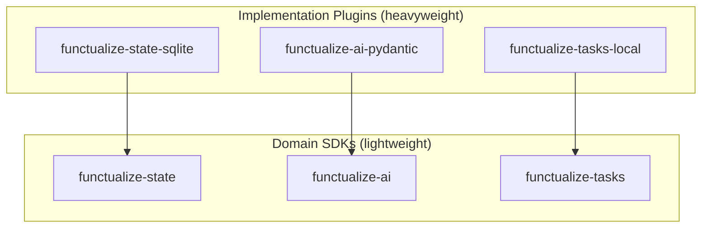

# Domain SDKs

Functualize's capabilities are organized as standalone Domain SDK packages. Each SDK defines a capability class, provider protocol, shared types, testing doubles, and domain metadata — carrying no heavy dependencies.

---

## Architecture



**Domain SDKs** define _what_ a capability does (protocols, types). **Implementation Plugins** provide _how_ it works (real backends, API clients).

!!! note "Interactivity is not a domain SDK"
    Interactivity is *presentation architecture* (a surface stack, phase-scoped
    activation, per-job `TTY`/`Live` grants), not backend selection with one
    active provider — so it was evicted from the domain-SDK pattern and folded
    into core. See [Interactivity](interactivity.md) and
    `contributor/adr/001-surface-architecture-collapse.md`.

---

## Available Domains

| Domain | SDK Package | Capability Class | Default Plugin |
|--------|-------------|-----------------|----------------|
| State | `functualize-state` | `StateBackend`, `ExecutionStore` | `functualize-state-sqlite` |
| AI | `functualize-ai` | `AI` | `functualize-ai-pydantic` |
| Tasks | `functualize-tasks` | `Tasks` | `functualize-tasks-local` |

---

## Using Domain SDKs

### In Jobs (DI Injection)

Capabilities are injected into job functions via type annotations:

```python
from functualize.job import RunContext
from functualize_ai import AI, ToolScope

def analyze(ai: AI, rc: RunContext):
    result = ai.complete("Analyze this data...", response_model=Analysis)
    rc.log(f"Analysis: {result.summary}")
```

### In Standalone Scripts

Use testing doubles directly without a project:

```python
from functualize_ai.testing import MockAI
from functualize_state import InMemoryState, StateNamespace

ai = MockAI(responses={"*summarize*": "Short summary"})
state = InMemoryState()
ns = StateNamespace(state, prefix="my:")
```

---

## Testing

Each SDK provides testing doubles that work without implementation plugins:

```python
from functualize_state import InMemoryState
from functualize_ai.testing import MockAI
from functualize_tasks.testing import MockTasks
```

For interactivity, `functualize.testing` provides `AutoPrompt` (and see the
`Surface`/`PromptCollector` test doubles in `tests/`).

These doubles are suitable for unit testing job logic without network calls, databases, or API keys.

---

## Writing a Custom Implementation

Implement the domain's provider protocol and register via entry point:

```python
# my_plugin/_provider.py
from functualize_state import StateBackend

class RedisBackend:
    def get(self, key, default=None): ...
    def set(self, key, value): ...
    def delete(self, key): ...
    def keys(self, prefix=""): ...
```

```toml
# pyproject.toml
[project.entry-points."functualize.state_providers"]
redis = "my_plugin:RedisPlugin"
```

See the [Plugin Examples](../examples/plugins/custom-state-backend.md) for a complete walkthrough.

---

## Auto-Selection

When only one implementation plugin is installed for a domain, functualize auto-selects it. No configuration needed.

When multiple implementations are installed, specify your choice in the config file:

```ini
[state]
provider = sqlite

[ai]
provider = pydantic
```

---

## Scaffolding

Generate new SDK or plugin packages:

```bash
func builtin scaffold add domain --name my-domain
func builtin scaffold add plugin --domain state --name redis
```

---

## Related

- [AI Capability Guide](ai.md)
- [Workflows Guide](workflows.md)
- [Plugins Guide](plugins.md)
- [Custom State Backend Example](../examples/plugins/custom-state-backend.md)
