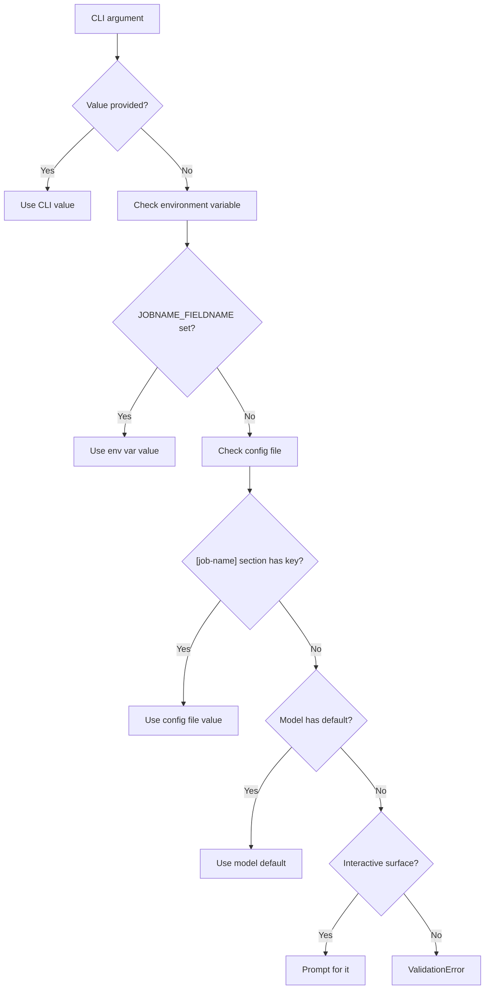

# JobConfig with Pydantic

Functualize lets you define typed, validated configuration for your jobs using Pydantic models. A **JobConfig** is a Pydantic `BaseModel` subclass whose fields are automatically converted to CLI options, resolved from multiple sources, and validated before your job runs.

## Defining a JobConfig Model

Create a Pydantic model by subclassing `BaseModel`. Each field becomes a configuration option for your job:

```python
from pydantic import BaseModel, Field


class DeployConfig(BaseModel):
    api_url: str = Field(description="The API endpoint URL")
    timeout: int = Field(default=30, description="Request timeout in seconds")
    verbose: bool = Field(default=False, description="Enable verbose output")
```

Key points:

- **Typed fields** — Use Python type annotations to declare the expected type for each field
- **Field descriptors** — Use `Field(description="...")` to provide help text that appears in `--help` output
- **Defaults** — Fields with a default value are optional; fields without a default are required

## Supported Field Types

JobConfig supports the following field types:

| Type | Description | Example |
|------|-------------|---------|
| `str` | String values | `name: str` |
| `int` | Integer values | `port: int` |
| `float` | Floating-point values | `threshold: float` |
| `bool` | Boolean flags | `debug: bool` |
| `Enum` subclass | Enumeration values | `env: Environment` |
| `Optional[T]` | Nullable variant of any supported type | `tag: Optional[str]` |
| `list[T]` | List of any supported base type or Enum | `targets: list[str]` |

!!! warning "Unsupported types raise TypeError"
    If you use a type not listed above, Functualize raises a `TypeError` at **job registration time** (when the application starts), not at runtime. This ensures you catch type errors early.

    ```python
    from pydantic import BaseModel

    class BadConfig(BaseModel):
        data: dict[str, str]  # (1)!
    ```

    1. `dict` is not a supported type — this raises `TypeError` when the job is registered.

    The error message indicates the unsupported type and lists all supported alternatives:

    ```
    TypeError: Unsupported type for field 'data': dict[str, str].
    Supported types are: str, int, float, bool, Enum subclasses,
    Optional[T] for supported T, and list[T] for supported T.
    ```

## CLI Option Conversion

JobConfig fields are automatically converted to Click CLI options. The conversion follows these rules:

### Field name to option name

Underscores in field names become hyphens in CLI options:

| Field name | CLI option |
|-----------|------------|
| `api_url` | `--api-url` |
| `max_retries` | `--max-retries` |
| `output_dir` | `--output-dir` |

### Boolean values

Bool fields accept the following truthy values (case-insensitive):

- `"true"`
- `"1"`
- `"yes"`

Any other value is treated as falsy.

### List fields

List fields accept **comma-separated strings** when provided via environment variables or config files:

```toml
[my-job]
targets = "service-a, service-b, service-c"
```

From the CLI, list values are passed as comma-separated strings as well.

### Enum fields

Enum fields are matched by **value first**, then by **case-insensitive name**:

```python
import enum

class Environment(enum.Enum):
    DEV = "development"
    STAGING = "staging"
    PROD = "production"
```

All of these resolve to `Environment.PROD`:

- `--env production` (matches value `"production"`)
- `--env PROD` (matches name, case-insensitive)
- `--env prod` (matches name, case-insensitive)

## Resolution Precedence

Each JobConfig field is resolved from multiple sources in this priority order (highest to lowest):



| Priority | Source | Convention |
|----------|--------|------------|
| 1 (highest) | CLI argument | `--field-name value` |
| 2 | Environment variable | `JOBNAME_FIELDNAME` (uppercased) |
| 3 | Config file section | Section name matches `job_name` |
| 4 (lowest) | Model default | Default value in the field definition |

If nothing supplies a **required** field, an interactive surface asks for it;
off one (CI, a pipe) the `ValidationError` is reported with the file that was
read and the variable that would set it.

!!! info "Environment variable naming"
    The environment variable name is formed by joining the **job name** and
    **field name** with a single underscore, both uppercased, with hyphens and
    dots flattened. For a job named `deploy` with a field `api_url`, the env var
    is `DEPLOY_API_URL`. For a group-qualified job `infra.deploy`, it is
    `INFRA_DEPLOY_API_URL`.

    This is the only spelling. `DEPLOY__API_URL` and a bare `API_URL` were both
    read at one time, ahead of the documented name; neither is any more. The
    bare form in particular meant a field called `user` silently resolved to
    your shell's `$USER` and its declared default was unreachable.

    [Group options](group-options.md) are the one exception, and a different
    feature: they keep `SCOPE__FIELD` (`DEPLOY__ENV`) because a nested group
    path is flattened with single underscores, so `DEPLOY_WEB_ENV` would be
    ambiguous with a group `deploy` carrying a field named `web_env`.

    Run `func builtin env <job>` to see the resolved names and which of them are
    actually set.

## Complete Example

Here's a full example showing a JobConfig model, its usage in a job function, and the resulting CLI behavior:

```python title="jobs/deploy_job.py"
import enum

from pydantic import BaseModel, Field

from functualize.job import RunContext


JOB_NAME = "deploy"  # (1)!


class Environment(enum.Enum):
    DEV = "development"
    STAGING = "staging"
    PROD = "production"


class DeployConfig(BaseModel):  # (2)!
    api_url: str = Field(description="The API endpoint URL")
    environment: Environment = Field(
        default=Environment.DEV, description="Target environment"
    )
    timeout: int = Field(default=30, description="Request timeout in seconds")
    dry_run: bool = Field(default=False, description="Run without making changes")
    targets: list[str] = Field(
        default_factory=list, description="Services to deploy"
    )


def run(rc: RunContext, config: DeployConfig):  # (3)!
    """Execute the deployment."""
    rc.log(f"Deploying to {config.api_url}", level="info")
    rc.log(f"Environment: {config.environment.value}", level="info")
    rc.log(f"Timeout: {config.timeout}s", level="info")

    if config.dry_run:
        rc.log("Dry run mode — skipping actual deployment", level="info")
        return

    for target in config.targets:
        rc.log(f"Deploying {target}...", level="info")
```

1. The `JOB_NAME` groups this module under the `deploy` sub-command and is used as the config section name and env var prefix.
2. `DeployConfig` subclasses `BaseModel` — Functualize detects it in the function signature and generates CLI options automatically.
3. The job function receives both `RunContext` and the resolved `DeployConfig` instance.

This generates the following CLI options:

```
Usage: my-app deploy run [OPTIONS]

Options:
  --api-url TEXT          The API endpoint URL
  --environment TEXT      Target environment
  --timeout INTEGER       Request timeout in seconds
  --dry-run BOOLEAN       Run without making changes
  --targets TEXT          Services to deploy
  --help                  Show this message and exit.
```

### Providing values from different sources

=== "CLI"

    ```bash
    my-app deploy run \
      --api-url https://api.example.com \
      --environment prod \
      --timeout 60 \
      --targets service-a,service-b
    ```

=== "Environment variables"

    ```bash
    export DEPLOY_API_URL=https://api.example.com
    export DEPLOY_ENVIRONMENT=prod
    export DEPLOY_TIMEOUT=60
    export DEPLOY_TARGETS=service-a,service-b

    my-app deploy run
    ```

=== "Config file"

    ```toml title="config.base.toml"
    [deploy]
    api_url = "https://api.example.com"
    environment = "prod"
    timeout = 60
    targets = "service-a, service-b"
    
```

    ```bash
    my-app deploy run
    ```

## ValidationError for Missing Required Fields

If a required field (one without a default value) has no value provided from any source — CLI, environment variable, or config file — Pydantic raises a `ValidationError` with field-level details:

```python
from pydantic import BaseModel, Field


class StrictConfig(BaseModel):
    api_url: str = Field(description="The API endpoint URL")  # (1)!
    region: str = Field(description="Deployment region")  # (2)!
```

1. No default value — this field is **required**.
2. Also required — must be provided from CLI, env var, or config.

Running the job without providing these fields:

```bash
my-app deploy run
```

Produces a validation error:

```
pydantic.ValidationError: 2 validation errors for StrictConfig
api_url
  Field required [type=missing, input_value={}, input_type=dict]
region
  Field required [type=missing, input_value={}, input_type=dict]
```

The error clearly identifies which fields are missing, helping you determine what values need to be provided.

## JobConfig in the TUI

When users launch `my-app tui`, each JobConfig field is rendered as an interactive widget. The mapping depends on the field type:

| Field Type | TUI Widget | Constrained in Form? |
|-----------|-----------|---------------------|
| `str` | Text input | No |
| `int` | Text input | No |
| `float` | Text input | No |
| `bool` | Checkbox | Yes (on/off only) |
| `Enum` | Select dropdown | Yes (limited to enum values) |
| `Optional[T]` | Same as `T` | No |
| `list[T]` | Text input | No |

### Validation happens on submit

Pydantic constraints like `ge`, `le`, `gt`, `lt`, `min_length`, and custom `@field_validator` decorators are **not enforced in the TUI form**. They are validated when the command actually runs (after the user presses ++ctrl+r++).

This means users can type any value into a text field — if it violates a Pydantic constraint, they'll see a `ValidationError` after submission.

!!! tip "Best practice: document constraints in descriptions"
    Since the TUI can't visually enforce numeric ranges or custom rules, always include the valid range or constraint in your field's `description`:

    ```python
    class MyConfig(BaseModel):
        port: int = Field(default=8080, ge=1, le=65535, description="Port number (1-65535)")
        retries: int = Field(default=3, ge=0, le=10, description="Retry count (0-10)")
    ```

    The description text appears as a label next to the form field in the TUI.

### Enum fields get dropdowns

Enum fields are the one type where the TUI **does** constrain input. They render as a `Select` dropdown that only allows choosing from the defined enum values:

```python
from enum import Enum
from pydantic import BaseModel, Field


class LogLevel(str, Enum):
    debug = "debug"
    info = "info"
    warning = "warning"
    error = "error"


class MyConfig(BaseModel):
    level: LogLevel = Field(default=LogLevel.info, description="Log level")
```

In the TUI, `--level` appears as a dropdown with options `debug`, `info`, `warning`, `error`.

## When to Use Phase Tracking vs Invoking a New Job

Jobs often have multiple phases. You can model them as phases within a single job, or as separate jobs invoked from a parent. Here's how to choose:

### Use `rc.track_phase()` when:

- Steps are **sequential within one logical operation** — they form a pipeline that only makes sense together
- You want **perf tracking per step** — each step gets its own timing entry in the performance timeline
- Steps **share the same config/context** — they read from the same `JobConfig` and environment

```python
def run(rc: RunContext, config: DeployConfig):
    rc.track_phase("validate", "Validating inputs", RunStatus.RUNNING)
    validate(config)
    rc.track_phase("validate", "Validation passed", RunStatus.SUCCESS)

    rc.track_phase("build", "Building artifact", RunStatus.RUNNING)
    artifact = build(config)
    rc.track_phase("build", "Build complete", RunStatus.SUCCESS)

    rc.track_phase("deploy", "Deploying artifact", RunStatus.RUNNING)
    deploy(artifact, config)
    rc.track_phase("deploy", "Deployed", RunStatus.SUCCESS)
```

### Use `rc.invoke()` when:

- The operation is **independently reusable** — other jobs or users might want to run it standalone
- It needs **its own config** — different parameters, different resolution sources
- It should **appear in the job list** — visible via `func --help` and the TUI
- You want **independent failure isolation** — a failure doesn't tear down the parent job's context

```python
def run(rc: RunContext, config: OrchestratorConfig):
    rc.invoke("validate", schema=config.schema)
    rc.invoke("build", target=config.target, optimize=True)
    rc.invoke("deploy", environment=config.environment)
```

### Rule of thumb

> If you'd want to run it standalone via `func step-name`, make it a separate job.
> If it's just a phase within one job, use tracking.

| Criterion | `track_phase()` | `invoke()` |
|-----------|------------------------|------------|
| Independently runnable | No | Yes |
| Own config/context | No (shares parent) | Yes |
| Appears in job list | No | Yes |
| Perf timeline entry | Yes | Yes (separate job) |
| Failure isolation | Fails parent | Independent |
| Typical use | Phases of one operation | Composing reusable jobs |

## Next Steps

- **[Configuration System](configuration.md)** — Understand the full layered config resolution including base and environment overlay files
- **[Jobs and Auto-Discovery](jobs-discovery.md)** — Learn how job modules are discovered and registered
- **[RunContext Lifecycle](run-context.md)** — Use lifecycle hooks alongside your JobConfig
- **[TUI Integration](tui.md)** — See how JobConfig fields render in the interactive TUI
