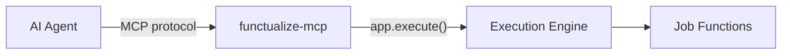

# MCP Adapter

The MCP adapter (`functualize-mcp`) exposes functualize jobs as MCP tools for external AI agents (Claude, Goose, Cursor, etc.). Jobs become discoverable and invocable without code changes.

---

## Quick Start

```bash
pip install "functualize[cli]" functualize-mcp

# Expose jobs via stdio transport (default)
func mcp serve

# Or via HTTP+SSE
func mcp serve --http --port 8080
```

---

## How It Works

1. MCP adapter discovers all visible jobs from the functualize registry
2. Jobs are translated into MCP tools using their docstring, config model, and metadata
3. External AI agents call `discover_jobs`, `get_job_schema`, and `run_job`
4. Results are returned as structured MCP responses



---

## Available MCP Tools

### Core Tools

| Tool | Description |
|------|-------------|
| `discover_jobs` | List all visible jobs with name, description, and tags |
| `get_job_schema(name)` | Get full JSON Schema of a job's config model |
| `run_job(name, config?)` | Execute a job synchronously and return results |
| `run_job_async(name, config?)` | Start a job and return an execution ID |
| `get_execution_status(id)` | Poll async execution state |

### Workflow Tools

| Tool | Description |
|------|-------------|
| `list_active_workflows()` | List paused/running workflows |
| `get_workflow_state(id)` | Current step, available tools, pending inputs |
| `resume_workflow(id, input)` | Advance a paused workflow |
| `cancel_workflow(id)` | Cancel execution |

### Task Tools (when Tasks domain active)

| Tool | Description |
|------|-------------|
| `add_task(title, linked_to?)` | Create a new task |
| `list_tasks(filter?, status?)` | Query tasks |
| `update_task(id, status?, notes?)` | Update task status |
| `plan_tasks(tasks)` | Replace entire task list |

### History Tools (when State domain active)

| Tool | Description |
|------|-------------|
| `get_job_history(name?, limit?)` | Query execution history |
| `get_execution_detail(id)` | Get full execution record |

---

## Job-to-Tool Translation

Jobs are automatically translated to MCP tools:

- **Tool name** → job name
- **Tool description** → first paragraph of job's `__doc__`
- **Input schema** → JSON Schema from Pydantic config model
- **Annotations** → from `@job_metadata` tags
- **Examples** → from `@job_metadata` examples

### Controlling Visibility

```python
@job_metadata(visibility="external")   # Exposed via MCP (default)
def deploy(...): ...

@job_metadata(visibility="internal")   # Hidden from MCP
def _helper(...): ...
```

CLI filtering:

```bash
func mcp serve --include-tags ai,safe      # Only expose tagged jobs
func mcp serve --exclude-jobs internal-job  # Hide specific jobs
```

---

## Schema Export

Export job schemas in multiple formats for AI agent knowledge bases:

```bash
func mcp schema --format json        # MCP tool definition format
func mcp schema --format markdown    # Parameters table per job
func mcp schema --format openai      # OpenAI function calling format
func mcp schema --format typescript  # TypeScript type definitions
func mcp tools                       # List exposed tools (no server)
```

---

## Multi-Server Management

Manage MCP servers for multiple functualize projects:

```bash
func mcp start ./project-a --name api --port 8080
func mcp start ./project-b --name worker --port 8081
func mcp list          # Show running servers
func mcp stop api      # Stop by name
func mcp stop --all    # Stop all
```

With `--enable-management`, expose management as MCP tools themselves:

```bash
func mcp serve --enable-management
# Exposes: mcp_start_server, mcp_list_servers, mcp_stop_server, mcp_get_server_tools
```

---

## AI_OUTBOUND Gate Strategy

When `functualize-mcp` is installed, workflows can pause and wait for an external AI agent:

```python
Step(name="review", awaits_input=ReviewInput, force_gate=True)
```

The workflow pauses, becomes visible via `list_active_workflows()`, and resumes when the AI agent calls `resume_workflow(id, input)`.

---

## Related

- [AI Inbound Example](../examples/standalone/ai-inbound.md)
- [Workflows Guide](workflows.md)
- [Domain SDKs Guide](domain-sdks.md)
