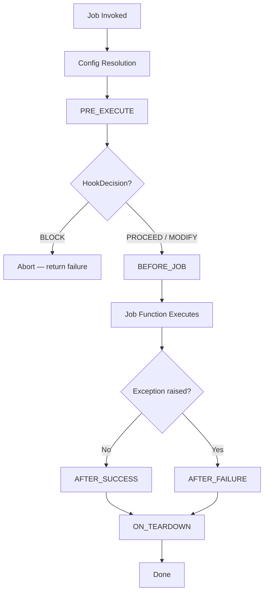
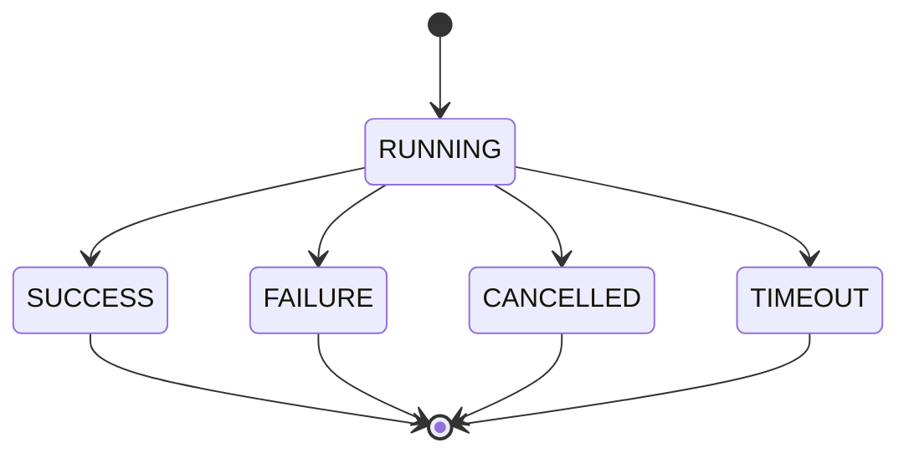

# RunContext Lifecycle

The `RunContext` is the execution context injected into every job function. It is a thin facade (~500 LOC) that delegates to capability classes (`Log`, `Invoke`, `Prompt`, `Perf`, `State`, `WorkflowTracker`). It provides configuration access, logging, metadata tracking, phase tracking, job invocation, and event emission.

```python
from functualize.job import RunContext, Log, Invoke, Prompt, Perf, State
```

This guide covers the lifecycle hooks that wrap job execution, the RunContext metadata fields, and how to track phase progress within your jobs.

## Lifecycle Hooks

Every job execution is wrapped in a lifecycle that fires hooks at specific points. Hooks let you add setup, teardown, and error handling logic without modifying the job function itself.

### Execution Order

Hooks fire in the following order during job execution:



| Hook | When it fires | Purpose |
|------|--------------|---------|
| `PRE_EXECUTE` | After config resolution, before the job function | Gate execution: block, modify kwargs, or proceed |
| `BEFORE_JOB` | Before the job function runs | Setup, validation, resource acquisition |
| `AFTER_SUCCESS` | After the job completes without exception | Cleanup on success, notifications |
| `AFTER_FAILURE` | When the job raises an exception | Error reporting, alerting, recovery |
| `ON_TEARDOWN` | Always, after either `AFTER_SUCCESS` or `AFTER_FAILURE` | Guaranteed cleanup regardless of outcome |

!!! important
    `ON_TEARDOWN` always fires — whether the job succeeded or failed. Use it for cleanup that must happen regardless of outcome (closing connections, releasing locks, etc.).

### Hook Callable Signatures

Hook callables have different signatures depending on the event:

```python
from functualize.job import RunContext

# BEFORE_JOB, AFTER_SUCCESS, ON_TEARDOWN — receive RunContext only
def my_hook(rc: RunContext) -> None:
    ...

# AFTER_FAILURE — receives RunContext AND the exception
def my_failure_hook(rc: RunContext, exception: Exception) -> None:
    ...
```

The `AFTER_FAILURE` hook receives the exception that caused the job to fail as its second argument. This lets you inspect the error, log details, or trigger alerts based on the exception type.

### Global vs Job-Scoped Hooks

Hooks can be registered at two levels:

- **Global hooks** — fire for every job execution
- **Job-scoped hooks** — fire only for a specific job (matched by job name)

When hooks are invoked, **global hooks execute first** (in registration order), then **job-scoped hooks execute** (in registration order):

```
1. Global hook A (registered first)
2. Global hook B (registered second)
3. Job-scoped hook X (registered first for this job)
4. Job-scoped hook Y (registered second for this job)
```

### Error Isolation

If a hook raises an exception during execution, the error is **logged and remaining hooks continue executing**. A failing hook does not prevent other hooks from running.

```python
def flaky_hook(rc: RunContext) -> None:
    raise RuntimeError("Something went wrong")

def important_hook(rc: RunContext) -> None:
    # This still executes even if flaky_hook fails
    rc.log("Important cleanup completed")
```

!!! note
    Hook errors are logged at the ERROR level with the hook function name, event type, and job name for debugging.

## RunContext Metadata

Each `RunContext` instance tracks metadata about the current execution. The metadata is stored as a dictionary with the following fields:

| Field | Type | Description |
|-------|------|-------------|
| `run_type` | `RunType` | The type of invocation (`JOB`, `COMMAND`, or `RUN`) |
| `run_status` | `RunStatus` | Current execution status |
| `start_time` | `datetime \| None` | UTC timestamp when execution started |
| `end_time` | `datetime \| None` | UTC timestamp when execution ended (set on terminal state) |
| `duration` | `float \| None` | Elapsed seconds (computed when reaching a terminal state) |

Access metadata via the `metadata` property:

```python
def my_job(rc: RunContext) -> None:
    print(rc.metadata["run_type"])    # RunType.JOB
    print(rc.metadata["run_status"])  # RunStatus.RUNNING
    print(rc.metadata["start_time"]) # datetime object (UTC)
```

### Run Status State Machine

The `RunStatus` enum defines the possible execution states:



| Status | Terminal? | Description |
|--------|-----------|-------------|
| `RUNNING` | No | Job is currently executing |
| `SUCCESS` | Yes | Job completed without error |
| `FAILURE` | Yes | Job raised an exception |
| `CANCELLED` | Yes | Job was cancelled |
| `TIMEOUT` | Yes | Job exceeded its time limit |
| `UNKNOWN` | No | Initial/indeterminate state |

!!! warning
    Terminal states (`SUCCESS`, `FAILURE`, `CANCELLED`, `TIMEOUT`) cannot be transitioned from. Attempting to change a terminal status raises `InvalidStateTransition`.

Update the run status with `track_run_status`:

```python
from functualize.job import RunContext
from functualize.types import RunStatus

def my_job(rc: RunContext) -> None:
    # Status starts as RUNNING
    rc.track_run_status(RunStatus.SUCCESS)

    # This would raise InvalidStateTransition:
    # rc.track_run_status(RunStatus.FAILURE)
```

## Logging

The `RunContext` provides a `log` method that delegates to the configured Python logger. Supported levels are `debug`, `info`, `warning`, `error`, and `critical`:

```python
def my_job(rc: RunContext) -> None:
    rc.log("Starting data processing")                    # info (default)
    rc.log("Connecting to database", level="debug")
    rc.log("Retrying failed request", level="warning")
    rc.log("Connection lost", level="error")
    rc.log("System is shutting down", level="critical")
```

### Log Callback Filters

You can register log callbacks that act as a **filter/transform chain**. Each callback receives `(level, message)` and returns `str | None`:

- Returning `None` **suppresses** the message — it is not passed to subsequent callbacks or the logger.
- Returning a `str` **replaces** the message for downstream callbacks and the logger.

Callbacks are invoked in registration order. If a callback raises an exception, the error is logged at WARNING level and the message passes unchanged to the next callback.

```python
def my_job(rc: RunContext) -> None:
    # Register a filter that suppresses debug messages
    rc.on_log(lambda level, msg: None if level == "debug" else msg)

    # Register a transform that adds a prefix
    rc.on_log(lambda level, msg: f"[{rc.job_name}] {msg}")

    rc.log("This gets prefixed", level="info")  # → "[my_job] This gets prefixed"
    rc.log("This is suppressed", level="debug")  # → suppressed, never reaches logger
```

!!! info "Chain semantics"

    Callbacks form a pipeline. If callback A transforms the message, callback B receives the transformed version. If callback A returns `None`, the entire chain short-circuits — no subsequent callbacks or the logger see the message.

## Job Phase Tracking

For jobs with multiple logical phases, `track_phase` records named steps with status, timing, and a message:

```python
from functualize.job import RunContext
from functualize.types import RunStatus

def etl_job(rc: RunContext) -> None:
    # Start the extract phase
    rc.track_phase("extract", "Fetching data from API")
    data = fetch_data()
    rc.track_phase("extract", "Extracted 1000 records", RunStatus.SUCCESS)

    # Start the transform phase
    rc.track_phase("transform", "Applying transformations")
    transformed = transform(data)
    rc.track_phase("transform", "Transformed 1000 records", RunStatus.SUCCESS)

    # Start the load phase
    rc.track_phase("load", "Writing to database")
    load(transformed)
    rc.track_phase("load", "Loaded 1000 records", RunStatus.SUCCESS)
```

Key behaviors:

- **Step identification**: Steps are identified by name. Calling `track_phase` with the same name updates the existing step rather than creating a new one.
- **Message truncation**: The `step_message` parameter is truncated to **1000 characters**. Messages longer than this are silently clipped.
- **Timing**: Each step records `start_time` (set on creation), `end_time`, and `duration` (computed when the step reaches a terminal status).
- **Terminal steps**: When a step transitions to a terminal status (`SUCCESS`, `FAILURE`, `CANCELLED`, `TIMEOUT`), its `end_time` and `duration` are automatically set.

## Complete Example

This example demonstrates registering lifecycle hooks (both global and job-scoped), handling failures with the exception argument, and tracking job phases:

```python
from functualize.app import FunctualizeApp
from functualize.job import RunContext
from functualize.types import RunStatus
from functualize.plugin import HookEvent, EventBus

# Create app (hook registration happens through the app's event_bus)
app = FunctualizeApp(name="data-sync")


# --- Global hooks (fire for all jobs) ---

def log_start(rc: RunContext) -> None:
    """Log when any job starts."""
    rc.log(f"Job '{rc.name}' starting")


def log_end(rc: RunContext) -> None:
    """Log when any job finishes (success or failure)."""
    status = rc.metadata["run_status"]
    duration = rc.metadata.get("duration")
    rc.log(f"Job '{rc.name}' finished with status: {status.value}, duration: {duration}s")


app.hook_registry.register_global(HookEvent.BEFORE_JOB, log_start)
app.hook_registry.register_global(HookEvent.ON_TEARDOWN, log_end)


# --- Job-scoped hooks (fire only for "data_sync") ---

def notify_failure(rc: RunContext, exception: Exception) -> None:
    """Send alert when data_sync fails."""
    rc.log(
        f"ALERT: data_sync failed with {type(exception).__name__}: {exception}",
        level="error",
    )


def release_lock(rc: RunContext) -> None:
    """Release distributed lock after data_sync completes."""
    rc.log("Releasing distributed lock", level="debug")


app.hook_registry.register_for_job("data_sync", HookEvent.AFTER_FAILURE, notify_failure)
app.hook_registry.register_for_job("data_sync", HookEvent.ON_TEARDOWN, release_lock)


# --- Job function with job phases ---

JOB_NAME = "data_sync"


def sync(rc: RunContext) -> None:
    """Synchronize data from external API to local database."""
    # Track extraction step
    rc.track_phase("extract", "Fetching records from API")
    records = fetch_from_api()
    rc.track_phase("extract", f"Fetched {len(records)} records", RunStatus.SUCCESS)

    # Track validation step
    rc.track_phase("validate", "Validating record schemas")
    valid_records = validate(records)
    rc.track_phase(
        "validate",
        f"Validated {len(valid_records)}/{len(records)} records",
        RunStatus.SUCCESS,
    )

    # Track load step
    rc.track_phase("load", "Writing to database")
    write_to_db(valid_records)
    rc.track_phase("load", f"Loaded {len(valid_records)} records", RunStatus.SUCCESS)

    rc.log("Data sync completed successfully")
```

When `sync` executes successfully, the hook invocation order is:

1. `log_start` (global `BEFORE_JOB`)
2. `sync` function body executes
3. No `AFTER_SUCCESS` hooks registered — skipped
4. `log_end` (global `ON_TEARDOWN`)
5. `release_lock` (job-scoped `ON_TEARDOWN`)

!!! tip
    Within each event, global hooks always fire before job-scoped hooks. Both groups execute in registration order.

If `sync` raises an exception:

1. `log_start` (global `BEFORE_JOB`)
2. `sync` function body raises an exception
3. `notify_failure` (job-scoped `AFTER_FAILURE`) — receives the exception
4. `log_end` (global `ON_TEARDOWN`)
5. `release_lock` (job-scoped `ON_TEARDOWN`)
6. Exception re-raised to caller

## Prompting for User Input

The `RunContext` provides methods for collecting user input during job execution via the interactivity system's `PromptCollector` protocol. See the [Interactivity Guide](interactivity.md) for the full architecture.

### `rc.prompt(request)`

The low-level method that accepts a `PromptRequest` and returns a `PromptResponse`:

```python
from functualize.plugin import PromptRequest

def my_job(rc: RunContext) -> None:
    request = PromptRequest(
        question="Enter the target environment",
        intent=PromptIntent.SELECT,
        choices=[
            PromptChoice(value="staging", label="Staging"),
            PromptChoice(value="production", label="Production"),
        ],
        default="staging",
    )
    response = rc.prompt(request)
    rc.log(f"Deploying to {response.value}")
```

If no `PromptCollector` is available and `required=True` with no default, raises `InputNotAvailable`. If a default is set, returns `PromptResponse(value=default, source="default")`.

### Convenience Methods

Three convenience methods handle common prompting patterns:

#### `rc.prompt_confirm(question, *, destructive=False, default=None)`

```python
def deploy_job(rc: RunContext) -> None:
    if not rc.prompt_confirm("Deploy to production?", destructive=True):
        rc.log("Deployment cancelled")
        return
    # proceed with deployment...
```

Returns `True` if confirmed, `False` if denied or cancelled.

#### `rc.prompt_choice(question, choices, *, default=None)`

```python
def my_job(rc: RunContext) -> None:
    env = rc.prompt_choice(
        "Select environment",
        ["development", "staging", "production"],
        default="staging",
    )
    rc.log(f"Selected: {env}")
```

Returns the selected value as a string.

#### `rc.prompt_text(question, *, default=None, secret=False, placeholder=None, validator=None)`

```python
def auth_job(rc: RunContext) -> None:
    token = rc.prompt_text(
        "Enter API token",
        secret=True,
        placeholder="sk-...",
    )
```

Returns the user's text input as a string.

## Custom Event Emission

### `rc.emit(event_name, resource="", **payload)`

Emit a custom structured event to the `EventBus` and every registered `Surface`:

```python
def etl_job(rc: RunContext) -> None:
    records = fetch_data()
    rc.emit(
        "etl.extract.complete",
        resource="customer_table",
        record_count=len(records),
        source="api",
    )
```

Events are dispatched to:

1. **EventBus subscribers** — any code that called `app.event_bus.subscribe("etl.extract.complete", handler)`
2. **Surface.handle_event()** — every registered surface receives a `StructuredEvent`

!!! warning "Framework event prefixes are reserved"

    Events starting with `job.execute.`, `job.teardown.`, `plugin.`, `config.`, `cli.`, or `tui.` are **not** dispatched to `on_event()` — those are routed through typed lifecycle methods. Use your own domain prefix for custom events.

## Job Invocation

### `rc.invoke(job_name, timeout=None, **kwargs)`

Invoke a sibling job as a child within the current execution tree:

```python
def orchestrator(rc: RunContext) -> None:
    # Basic invocation
    result = rc.invoke("validate-data", source="api")

    # With timeout (seconds) — returns TIMEOUT status on expiry
    result = rc.invoke("slow-job", timeout=30.0, batch_size=100)

    if result.status == RunStatus.SUCCESS:
        rc.log(f"Child succeeded: {result.return_value}")
    elif result.status == RunStatus.TIMEOUT:
        rc.log("Child timed out", level="warning")
```

Returns a `JobResult` with status, duration, return value, and any exception.

### `rc.invoke_parallel(jobs)`

Invoke multiple jobs concurrently (1-32 jobs). Each child gets an independent `RunContext` with its own `StateStore`:

```python
def fan_out(rc: RunContext) -> None:
    jobs = [
        ("process-shard", {"shard_id": 0}),
        ("process-shard", {"shard_id": 1}),
        ("process-shard", {"shard_id": 2}),
    ]
    results = rc.invoke_parallel(jobs)  # (1)!

    failures = [r for r in results if r.status != RunStatus.SUCCESS]
    if failures:
        rc.log(f"{len(failures)} shards failed", level="error")
```

1. Returns `list[JobResult]` in the same positional order as the input list.

!!! note "Constraints"

    - 1-32 jobs per call (raises `ValueError` outside this range)
    - Each job has a 300-second per-job timeout
    - `INVOKE_START` / `INVOKE_END` hooks fire for each child job

## Job Introspection

### `rc.get_job_schema(job_name)`

Introspect a registered job's `JobDescriptor` at runtime:

```python
def dynamic_orchestrator(rc: RunContext) -> None:
    schema = rc.get_job_schema("data-sync")
    rc.log(f"Job group: {schema.group}")
    rc.log(f"Config fields: {list(schema.config_schema.model_fields.keys())}")
```

Returns the `JobDescriptor` for any registered job (including dynamic jobs). Raises `JobNotFoundError` if the job doesn't exist.

## Result Metadata

### `rc.set_result_metadata(key, value)`

Attach metadata key-value pairs to the `JobResult`. Limited to 64 keys maximum:

```python
def my_job(rc: RunContext) -> None:
    records = process_data()
    rc.set_result_metadata("record_count", len(records))
    rc.set_result_metadata("source", "api-v2")
    # Metadata appears in JobResult.metadata after execution
```

- Updating an existing key always succeeds
- Adding a new key beyond the 64-key limit is silently discarded
- Metadata is available on the `JobResult.metadata` field after execution
