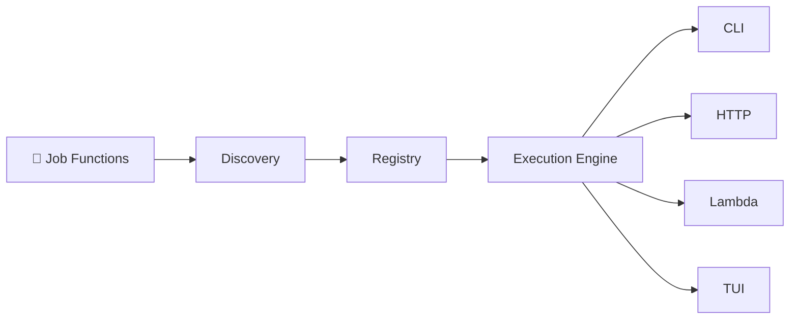
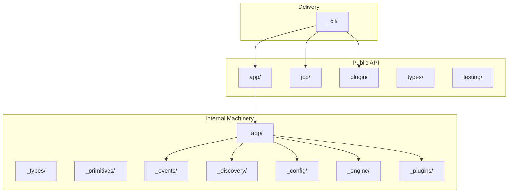

# Functualize

A Python framework for building structured, discoverable job pipelines with pluggable delivery surfaces.

[Get Started](getting-started/index.md){ .md-button .md-button--primary }
[View on GitHub](https://github.com/raicing-ai/functualize){ .md-button }

---

## The Mental Model

Functualize is a **discovery → execution → delivery** pipeline. You write job functions. Functualize finds them, configures them, runs them through a structured engine, and delivers results through whatever surface you need — CLI, HTTP, Lambda, TUI, or your own custom adapter.



You focus on writing job logic. Functualize handles the plumbing.

---

## Three Audiences

Functualize is designed for three roles, each with a clear import path:

| Role | You want to... | Import from |
|------|---------------|-------------|
| **Job Author** | Write job functions with structured context | `functualize.job` |
| **App Constructor** | Wire up an application with config, plugins, adapters | `functualize.app` |
| **Plugin Author** | Extend the framework with providers, renderers, adapters | `functualize.plugin` |

```python
# Job author — write a job function
from functualize.job import RunContext, Log

def deploy(rc: RunContext):
    rc.log("Deploying to production...")

# App constructor — build and configure the app
from functualize.app import FunctualizeApp, JobSources, twelve_factor

app = FunctualizeApp(
    "myapp",
    job_sources=JobSources(directories=["jobs/"]),
    config_sources=twelve_factor(),
)

# Plugin author — extend the framework
from functualize.plugin import EventBus, JobProvider, AdapterPlugin
```

---

## Use Cases: From Simple to Full Framework

### Single-file script

One file, one job. Run it directly.

```python
# deploy.py
from functualize.job import RunContext

def deploy(rc: RunContext):
    rc.log("Deploying...")
    return {"status": "done"}
```

```bash
func deploy.py deploy
```

### Multi-job project

A `jobs/` directory with auto-discovery. No manual registration needed.

```
myproject/
├── jobs/
│   ├── deploy.py
│   ├── migrate.py
│   └── healthcheck.py
└── pyproject.toml
```

```bash
func deploy       # auto-discovered from jobs/
func migrate
func healthcheck
```

### Full framework with plugins

Custom configuration, plugins, multiple delivery surfaces.

```python
from functualize.app import FunctualizeApp, JobSources, ConfigSources, twelve_factor
from functualize.app.adapters import CliAdapter

app = FunctualizeApp(
    "platform-ops",
    job_sources=JobSources(directories=["jobs/", "workflows/"]),
    config_sources=twelve_factor(dotenv=True),
)

# Deliver via CLI
adapter = CliAdapter(app)
adapter.run()
```

Or deploy the same jobs as an HTTP service or Lambda handler — same jobs, different delivery surface.

---

## What Functualize Gives You

| Capability | Description |
|-----------|-------------|
| **Auto-discovery** | Drop job functions in a `jobs/` directory. Functualize finds them, extracts metadata, and registers them — no boilerplate. |
| **Structured execution** | Every job runs through `RunContext` with logging, invocation, workflow tracking, dependency injection, and event emission built in. |
| **Layered configuration** | CLI args → environment variables → config files → defaults. Pluggable sources, preset strategies (`classic`, `twelve_factor`, `env_only`). |
| **Domain SDK ecosystem** | AI, State, Tasks, Interactivity — each with protocols, testing doubles, and swappable implementations. |
| **Declarative workflows** | Multi-step graphs with `@workflow`, conditional branching, gates, and scope-tracked execution. |
| **Plugin system** | Extend with job providers, output renderers, input providers, format providers, and lifecycle hooks — all via protocols. |
| **Multiple delivery surfaces** | The same jobs run via CLI, HTTP API, AWS Lambda, MCP (AI agents), or TUI. Write once, deliver everywhere. |
| **Dependency injection** | Register services with `app.provide()`. Jobs access them via `rc[MyService]`. No global state. |
| **Event system** | Structured publish-subscribe via `EventBus`. Jobs emit custom events, plugins react. |

---

## Quick Links

- **[Getting Started](getting-started/index.md)** — Install and build your first project in minutes
- **[Guides](guides/index.md)** — Configuration, jobs, plugins, and architecture deep-dives
- **[Domain SDKs](guides/domain-sdks.md)** — AI, State, Tasks, Interactivity SDK packages
- **[Workflows](guides/workflows.md)** — Multi-step job graphs with gates and conditional branching
- **[MCP Adapter](guides/mcp.md)** — Expose jobs to external AI agents
- **[API Reference](api/index.md)** — Reference for all public modules
- **[CLI Reference](cli/index.md)** — Commands and options for the `func` CLI
- **[Examples](examples/index.md)** — Standalone scripts, full projects, and plugin authoring
- **[Contributing](contributing.md)** — How to contribute

---

## Architecture at a Glance

Under the hood, functualize separates **public API** (what you import) from **internal machinery** (what makes it work):



The `_cli/` layer uses **only the public API** — proving that the public API is complete enough for any external tool to build on. See the [Architecture Guide](guides/architecture.md) for the full picture.
